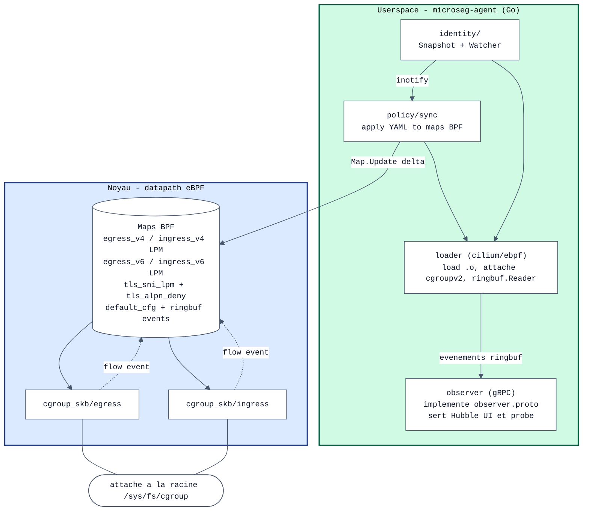
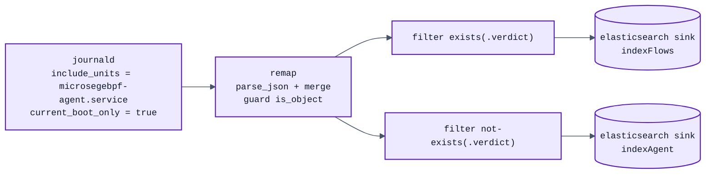
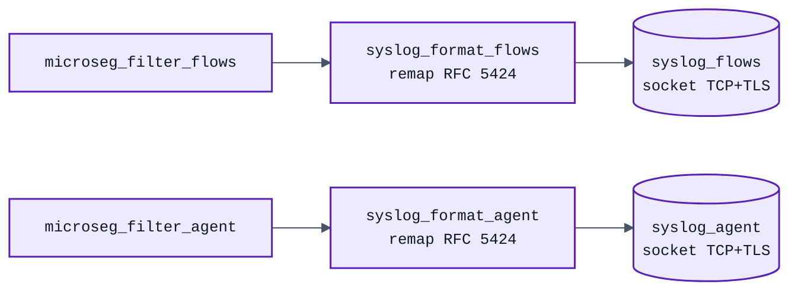

# Architecture

[English](ARCHITECTURE.md) · [Français](ARCHITECTURE.fr.md)

Ce document explique la conception interne de `nixos-microsegebpf` —
pourquoi chaque composant existe, comment les données circulent dans le
système, et les décisions non évidentes qui structurent la base de
code. Il s'adresse aux contributeurs et aux ingénieurs sécurité qui
veulent auditer ou étendre l'agent.

Pour un aperçu utilisateur, voir [README.fr.md](README.fr.md).

---

## 1. Le problème qu'on résout

La question de départ était : *peut-on mettre une microsegmentation par
identité de type Cilium sur un poste de travail Linux unique ?* Les
deux outils existants évidents ont été écartés avant la première ligne
de code :

- **Cilium lui-même** suppose Kubernetes. Son modèle d'identité repose
  sur des labels de pods résolus par un serveur API Kubernetes ; son
  datapath s'attache aux interfaces veth de pods créées par le plugin
  CNI ; son moteur de policy travaille sur des CRD
  `CiliumNetworkPolicy` dont les identités sont allouées via un
  KVStore etcd. Privé de ces éléments, Cilium n'a aucune notion de
  « quel est l'endpoint local de ce paquet ? » sur un poste.

- **Tetragon**, l'extraction bare-metal de Cilium par Isovalent, était
  plus proche. Il fonctionne en standalone, surveille une
  `TracingPolicy`, et utilise la même bibliothèque Go `cilium/ebpf`.
  Mais la surface d'enforcement de Tetragon est **au niveau syscall** :
  une `kprobe` sur `tcp_connect` plus `SIGKILL` ou override de la
  valeur de retour. Il n'y a pas de datapath paquet dans
  l'arborescence Tetragon (`bpf/process/`, `bpf/cgroup/`, pas
  d'équivalent `bpf_lxc.c`/`bpf_host.c`). Ce n'est pas un firewall,
  c'est un outil d'observabilité de sécurité runtime. Les deux sont
  complémentaires, pas substituables.

Le manque, donc : une couche d'enforcement au niveau paquet qui
utilise les primitives d'identité *du poste* (id cgroupv2, unité
systemd, uid) au lieu des labels Kubernetes, et qu'on puisse observer
avec l'outil que les opérateurs connaissent déjà — Hubble UI.

`nixos-microsegebpf` est exactement ce manque.

## 2. Architecture haut niveau



Deux points d'attache (egress + ingress) sur la racine cgroupv2
signifient que tout processus de l'hôte hérite de la policy. La
structure map-de-LPMs garde le code userspace simple : un `Update()`
par tuple `(cgroup, dst, port, proto)` au lieu de maps imbriquées.

## 3. Le datapath eBPF en détail

### 3.1 Pourquoi `cgroup_skb` plutôt que TC ou XDP

Trois candidats étaient considérés :

| Hook | Avantages | Inconvénients | Verdict |
|---|---|---|---|
| **TC ingress/egress** sur chaque interface | Bien établi, supporté sur tout kernel | Ne connaît pas nativement le cgroup local ; il faut `bpf_sk_lookup_tcp` + reverse-walk ; doit être attaché par interface (lo, wlan0, virtuelles) | Rejeté — trop de glue |
| **XDP** | Chemin le plus rapide | Egress uniquement via le egress hook ; ne connaît pas le cgroup ; overkill pour les volumes de trafic poste | Rejeté |
| **cgroup_skb/{ingress,egress}** | Connaît le cgroup local nativement (`bpf_skb_cgroup_id`) ; un seul attach pour toutes les interfaces ; couvre `lo` (utile pour l'IPC) ; hérite vers le bas dans la hiérarchie cgroupv2 | Coût par paquet légèrement supérieur à TC/XDP | **Choisi** |

Pour un poste qui pousse bien moins de 10 Gbps, `cgroup_skb` est le
bon compromis. Il offre aussi une voie propre pour scoper la policy à
un sous-cgroup plus tard (on peut attacher un programme additionnel à
un cgroup `firefox.service` spécifique pour des overrides) sans
changer l'architecture globale.

### 3.2 Layout de la clé LPM

Le type de map eBPF est `BPF_MAP_TYPE_LPM_TRIE`. Chaque clé est une
struct packée :

```c
struct lpm_v4_key {
    __u32 prefix_len;   // bits à matcher en partant APRÈS ce champ
    __u64 cgroup_id;    // partie exact-match (8 octets)
    __u16 peer_port;    // partie exact-match (2 octets, network byte order)
    __u8  protocol;     // partie exact-match (1 octet)
    __u8  ip[4];        // partie CIDR-match (variable)
} __attribute__((packed));
```

Un trie LPM matche les `prefix_len` premiers bits de `clé + 4 octets`
(en sautant le champ `prefix_len` lui-même). Pour forcer un match exact
sur `(cgroup_id, peer_port, protocol)` tout en laissant un CIDR sur
l'IP, on règle :

```
prefix_len = 88 + ip_prefix
              ^    ^
              │    └── 0..32 (v4) ou 0..128 (v6)
              └─── exact : 64 + 16 + 8 = 88 bits d'en-tête
```

Ça marche parce que LPM est purement bitwise, préfixe-depuis-MSB. Les
champs d'en-tête occupent les bits 0..87 et doivent matcher
exactement ; l'IP occupe les bits 88+ et est matchée jusqu'à
`ip_prefix` bits supplémentaires. Le préfixe le plus long gagne, donc
une entrée `/32` prend naturellement le pas sur une entrée `/24` qui
prend le pas sur une entrée `/0` — l'auteur de la policy obtient la
sémantique la moins surprenante gratuitement.

Le même schéma fonctionne pour IPv6 avec `ip[16]` et des longueurs de
préfixe jusqu'à `88 + 128 = 216`.

### 3.3 Le ring buffer pour les événements de flux

Le verdict est appliqué dans le noyau sans aller-retour userspace —
mais on veut quand même que chaque paquet apparaisse dans Hubble. Le
programme eBPF réserve un enregistrement sur `BPF_MAP_TYPE_RINGBUF`
(1 MiB), le remplit avec le 5-tuple + verdict + cgroup + id de policy,
et soumet. Si le buffer est plein (consommateur lent),
`bpf_ringbuf_reserve` retourne NULL et on drop silencieusement
l'*événement* sans affecter le *verdict du paquet*.

Deux boutons configurables contrôlent le volume d'événements :

- `microseg_cfg.emit_allow_events` (défaut : 0) — quand à zéro, seuls
  les verdicts DROP et LOG produisent des événements. Les paquets
  ALLOW passent quand même par le chemin de verdict, mais ne sont pas
  visibles dans Hubble. C'est le réglage de production ; sur un hôte
  chargé, émettre un événement par paquet sature le ring.
- `microseg_cfg.default_egress_verdict` / `default_ingress_verdict` —
  le verdict appliqué quand aucune entrée LPM ne matche. Défaut :
  ALLOW dans les deux directions, ce qui rend l'agent observe-only
  jusqu'à opt-in explicite via les policies.

### 3.4 Pourquoi `__attribute__((packed))`

Sans, GCC/clang inséreraient du padding pour aligner `cgroup_id` sur
8 octets, cassant le layout de clé LPM que userspace construit.
L'attribut packed est obligatoire ; les deux côtés s'accordent sur le
format de transmission.

### 3.5 Pourquoi `BPF_F_NO_PREALLOC`

Les tries LPM ne peuvent pas être préalloués. `BPF_F_NO_PREALLOC` est
exigé par le noyau, sinon la création de map échoue avec `EINVAL`.

## 4. Userspace : comment une policy YAML devient une entrée de map BPF

Le pipeline est `pkg/policy/sync.go::Apply()` :

1. **Parcours de l'arbre cgroup.** `identity.Snapshot()` fait un seul
   `WalkDir` récursif de `/sys/fs/cgroup`, en appelant `Stat` sur
   chaque répertoire pour lire son inode (= la valeur que renvoie
   `bpf_get_current_cgroup_id()`). Chaque répertoire devient un
   enregistrement `Cgroup{ID, Path, SystemdUnit}`. L'unité systemd est
   extraite en regardant le dernier composant du chemin pour des
   suffixes connus (`.service`, `.scope`, `.socket`, ...).

2. **Résolution des selectors.** Pour chaque `PolicyDoc` du YAML
   chargé, on filtre le snapshot cgroup :
   - `selector.systemdUnit: firefox.service` matche tout cgroup dont
     le nom d'unité globe sur `firefox.service`
   - `selector.cgroupPath: /user.slice` matche tout cgroup dont le
     chemin commence par `/user.slice/` (ou est exactement ce chemin)

3. **Expansion des règles.** Pour chaque paire `(cgroup, règle)`, on
   étend en une entrée de map BPF par `(port, protocol)`. Une plage
   de ports `8000-8099` produit 100 entrées × `len(protocols)`. Un
   garde-fou rejette toute règle qui produirait plus de
   `maxExpansion = 16384` entrées — sinon une erreur du type « bloquer
   0.0.0.0/0 ports 1-65535 » exploserait la map.

4. **Push vers les maps BPF par réconciliation delta.** La
   `lpm_v?_key` de chaque entrée est construite avec le
   `prefix_len` correct. Le syncer fait alors tourner un
   réconciliateur générique `applyDelta[K comparable]` sur chacune
   des six maps (`egress_v4`, `ingress_v4`, `egress_v6`,
   `ingress_v6`, `tls_sni_lpm`, `tls_alpn_deny`) :

   1. Snapshot du contenu actuel de la map dans une map Go.
   2. Pour chaque entrée désirée dont la valeur diffère (ou est
      absente), un `Map.Update(&key, &val, UpdateAny)` — atomique
      au niveau noyau (RCU). Les entrées avec valeur identique ne
      sont pas touchées du tout.
   3. Une fois tous les ajouts/updates posés, on supprime les clés
      qui étaient dans la map mais absentes du nouveau set désiré.

   Cet ordre adds-en-premier, deletes-en-dernier est la **garantie
   sans coupure** : il n'y a aucune fenêtre transitoire pendant
   laquelle un flux qui matche à la fois l'ancienne et la nouvelle
   policy verrait une entrée manquante. En régime stable (pas de
   changement de policy entre deux ticks) le réconciliateur ne
   fait zéro syscall par map. L'ancien pattern flush-puis-fill a
   disparu — voir `pkg/policy/sync.go::applyDelta` pour
   l'implémentation.

### 4.1 La sentinelle « any port »

Une règle sans champ `ports:` est censée matcher tout port L4. Le
match exact LPM sur le champ port nous obligerait à insérer 65535
entrées, ce qui est ridicule. À la place, on insère une entrée avec
`port=0` et on ajuste `prefix_len` pour sauter complètement le champ
port :

```
prefix_len = 64 (cgroup) + 8 (proto) + ip_prefix     // saute le port
```

Le côté lookup ne sait rien de tout ça — il construit toujours une clé
avec le port peer réel, prefix_len = 88 + 32. Le trie renvoie le match
le plus spécifique : une entrée port-aware gagne sur le wildcard à
cause de la sémantique LPM.

### 4.2 Hot reload via inotify

Le PoC original utilisait une re-résolution périodique toutes les 5
secondes. Acceptable en régime stationnaire mais lent quand un
utilisateur se logue (des dizaines de nouveaux cgroups créés en
quelques centaines de millisecondes pour `user@1000.service`,
`session-N.scope`, chaque unité transitoire, ...).

`pkg/identity/watcher.go` remplace le timer par un vrai watcher basé
sur `inotify`. Deux goroutines collaborent :

- `readLoop` est une boucle de drain serrée sur le file descriptor
  inotify. Pour chaque événement, elle identifie s'il concerne une
  création/suppression de répertoire cgroup (via `IN_ISDIR`), met à
  jour le set de watches, et signale un canal interne brut.
- `debounceLoop` collapse les bursts : il reset un timer de 250 ms à
  chaque signal brut et émet un wake-up sur le canal public
  `Events()` quand le timer expire. Une connexion utilisateur qui
  crée 30 cgroups en 150 ms produit un seul wake-up.

Le syncer de policy de l'agent souscrit à `Events()` et déclenche un
`Apply()` à chaque wake-up. Un ticker lent de filet de sécurité
(`-resolve-every 60s`) tourne quand même au cas où inotify perdrait
un événement (il y a une limite de queue noyau ; sous pression
soutenue des événements peuvent être droppés).

### 4.3 Pourquoi deux goroutines au lieu d'une

L'approche naïve est une seule goroutine qui fait un `select` sur
`unix.Read(fd)` et un `time.Timer.C`. C'est cassé : `unix.Read` est un
syscall bloquant, pas une opération de canal Go, donc le `select` ne
peut pas multiplexer dessus. Le timer ne se déclenche jamais avant que
Read ne retourne. La fenêtre de debounce dégénère en « un événement
par burst d'activité du file descriptor », ce qu'on a déjà sans le
code en plus.

Séparer le reader du debouncer donne la vraie concurrence. Le reader
bloque dans `Read` ; fermer le fd depuis `Close()` le débloque avec
`EBADF`.

### 4.4 Pourquoi le watcher fan-out vers plusieurs subscribers

Le watcher expose `Subscribe() <-chan struct{}` plutôt qu'un canal
`Events` partagé. Deux consommateurs ont besoin de savoir que
l'arbre cgroup change :

  * le **policy syncer** — doit ré-résoudre les selectors et mettre
    à jour les maps BPF pour que le trafic du nouveau cgroup ait le
    bon verdict ;
  * le **cache d'unités** — doit rafraîchir son mapping
    cgroup_id → unité systemd pour que les events de flux affichent
    le bon label `unit=...`.

Le premier PoC pointait les deux sur le même canal bufferisé
(`make(chan struct{}, 1)`) et a livré. La CI a ensuite exposé la
conséquence : **un canal Go délivre chaque envoi à exactement un
récepteur**, donc les deux consommateurs se faisaient la course à
chaque wake-up. La moitié du temps le cache d'unités gagnait — les
events portaient le bon nom d'unité mais la map BPF gardait
l'ancien set de policies, le nouveau cgroup n'y était pas, et
`policy_id=0` (default-allow) passait à travers. C'est ce mode de
défaillance qui a mangé quatre runs CI avant le diagnostic.

`Subscribe()` retourne un canal frais par appelant. `debounceLoop`
termine chaque période de calme par un appel à `broadcast()`, qui
itère sur chaque subscriber enregistré et fait un send non-bloquant
sur chacun. Un subscriber lent drop son propre event sans
back-pressure les autres ; les rapides suivent.

Le piège côté consommateur : appeler `Subscribe()` **une fois** avant
la boucle `for { select { ... } }`. L'appeler dans le corps de la
boucle ajouterait un subscriber frais à chaque itération et
fuiterait des canaux indéfiniment.

### 4.5 Cache de résolution FQDN (security-relevant)

Les règles `host:` passent par `Syncer.resolveRuleTargets`, qui
appelle `net.DefaultResolver.LookupIPAddr` avec un timeout
context de 2 secondes. Sans caching, chaque tick Apply re-issue
la requête resolver — doublant la surface d'attaque
resolver-poisoning (une réponse DNS malveillante entre deux
ticks flippe l'entrée LPM `/32` vers l'IP que l'attaquant veut).

Le syncer maintient une map in-process keyée sur le FQDN avec un
TTL honoré au lookup :

```go
type dnsCacheEntry struct {
    nets    []*net.IPNet
    expires time.Time
}
```

Défaut TTL=60s (`-dns-cache-ttl=60s` flag agent,
`services.microsegebpf.dnsCacheTTL` option). `0s` désactive le
cache complètement (debug). Cycle de vie d'un slot :

1. **Cache hit** (`time.Now().Before(e.expires)`) → retourne une
   copie de `e.nets` à l'appelant. Les pointeurs IPNet sont
   immutables donc on les partage ; on copie le slice pour que
   l'`append` de l'appelant ne mute pas l'entrée cachée.
2. **Cache miss / expired** → résout, stocke le résultat,
   retourne.
3. **Échec resolver** → si une entrée stale existe, log un WARN
   et la réutilise pour un cycle de plus. Stale-while-error
   garde une règle FQDN known-good qui enforce pendant une
   panne resolver transitoire ; sans ce fallback, un hoquet
   resolver de 30 secondes flusherait chaque entrée LPM `host:`
   des maps.

Le cache vit dans `Syncer` (un par agent) et est mutex-protected
par le même `s.mu` qu'`Apply()` tient déjà pour toute la
réconciliation. Pas de lock supplémentaire ; les paths read et
write sont dans la section critique. `SetDNSCacheTTL` wipe le
cache pour qu'un changement de TTL prenne effet immédiatement
plutôt qu'attendre l'expiration naturelle de la plus vieille
entrée stale.

Ça ne remplace pas DNSSEC. L'agent fait toujours confiance au
resolver upstream ; le cache rétrécit la *fenêtre temporelle*
pendant laquelle un attaquant peut empoisonner la réponse. Les
opérateurs qui veulent des garanties plus fortes devraient
combiner ce projet avec un resolver local DNSSEC-validating
(ex. `unbound`).

## 5. L'observer Hubble

`pkg/observer/server.go` implémente trois RPC du service
`cilium.observer.Observer` :

- `ServerStatus` — nombre total de flux, taille max du ring, uptime,
  « 1 nœud connecté »
- `GetNodes` — une entrée `Node` avec le hostname local et l'état
  `NODE_CONNECTED`
- `GetFlows(stream)` — replay du buffer de flux récents (du plus
  ancien au plus récent, jusqu'à `limit`), puis tail live des
  nouveaux flux indéfiniment en option

Les autres RPC du fichier proto (`GetAgentEvents`, `GetDebugEvents`,
`GetNamespaces`) retournent `Unimplemented`. Hubble UI dégrade
proprement : le panneau agent-events est vide, le sélecteur de
namespace ne montre que « microseg », tout le reste fonctionne.

La conversion de flux (`pkg/observer/flow.go::ToFlow`) construit un
vrai protobuf `flow.Flow` avec deux endpoints. Le cgroup local devient
soit `Source` soit `Destination` selon la direction ; le peer distant
est toujours un endpoint `world` avec l'identité réservée 2 (le
`RESERVED_IDENTITY_WORLD` de Cilium). Le cgroup reçoit une identité
déterministe en hashant son id avec FNV-32a, de sorte que la même
unité systemd a une identité stable d'un redémarrage d'agent à
l'autre. Les labels sont posés pour que Hubble UI puisse grouper les
flux dans la service map :

```
microseg.cgroup_id=12345
microseg.unit=firefox.service
k8s:io.kubernetes.pod.namespace=microseg   # apaise la logique namespace de hubble-ui
```

Le champ « pod name » est posé sur le nom d'unité systemd, donc la
service map affiche `firefox.service` comme nœud — le visuel naturel.

### 5.1 Back-pressure des subscribers

Chaque stream `GetFlows` connecté reçoit un canal bufferisé (256
entrées). Quand le publisher pousse un flux, il fait un `select` avec
`default` sur le canal de chaque subscriber — les consommateurs lents
droppent les événements sans ralentir l'agent. Hubble UI lui-même se
comporte de la même façon ; ce n'est pas une régression.

### 5.2 Sécurité du transport : TLS / mTLS pour l'observer gRPC

Le déploiement par défaut utilise
`unix:/run/microseg/hubble.sock` avec `RuntimeDirectoryMode =
0750` — seul root sur le poste peut se connecter. Pas besoin de
TLS ; le noyau médie.

Quand l'opérateur switche vers un listener TCP (`hubble.listen =
"0.0.0.0:50051"`), l'agent accepte une config TLS optionnelle :

```go
type TLSConfig struct {
    CertFile      string  // cert serveur (PEM)
    KeyFile       string  // clé serveur (PEM)
    ClientCAFile  string  // bundle CA pour vérifier les certs clients (mTLS)
    RequireClient bool    // exige + vérifie un cert client valide
}
```

Les knobs server-side sont câblés via les flags
`-hubble-tls-cert`, `-hubble-tls-key`, `-hubble-tls-client-ca`,
`-hubble-tls-require-client` sur l'agent (et les options
correspondantes `services.microsegebpf.hubble.tls.*` dans le
module NixOS). Quand `CertFile` + `KeyFile` sont posés tous les
deux, `Server.Serve` wrap le listener avec
`grpc.Creds(credentials.NewTLS(...))` en TLS 1.2+ minimum. Quand
`ClientCAFile` est aussi posé :

- `RequireClient = true` → `tls.RequireAndVerifyClientCert` (mTLS hard)
- `RequireClient = false` → `tls.VerifyClientCertIfGiven` (mTLS optionnel)

Deux warnings complémentaires préviennent l'exposition cleartext
silencieuse :
- Le module NixOS émet un warning au moment de l'évaluation
  quand `hubble.listen` est TCP et `hubble.tls.{certFile,keyFile}`
  est unset.
- L'agent émet une ligne slog WARN au démarrage avec le même
  wording. Même si l'opérateur bypass le module
  (`microseg-agent` invoqué direct depuis le CLI), le warning
  surface.

Le CLI `microseg-probe` mirrore le côté client : `-tls-ca`,
`-tls-cert`, `-tls-key`, `-tls-server-name`, `-tls-insecure`. Le
ServerName par défaut est la portion host de `-addr`, ce qui
matche le pattern SAN typique. `buildClientCreds` enforce
`MinVersion = TLS 1.2` ; poser `-tls-insecure` print un warning
stderr.

Les deux côtés laissent le system trust store en fallback (pas
de `-tls-ca` → vérifie contre `/etc/ssl/certs/`). La combinaison
duale `-tls-ca` / `-tls-cert+-tls-key` supporte n'importe quel
setup CA interne + mTLS sans tooling de config supplémentaire.

Matrice testée dans la VM dev :

| Config probe | Résultat |
|---|---|
| CA valide + cert client valide + ServerName correct | ✅ ServerStatus + GetNodes + GetFlows |
| CA valide, pas de cert client | ❌ `tls: certificate required` (rejection mTLS) |
| Pas de TLS du tout (TCP plain) | ❌ `error reading server preface: EOF` |

## 6. Module NixOS

`nix/microsegebpf.nix` est un module NixOS standard avec les options
`services.microsegebpf.*`. Deux pièces méritent d'être soulignées :

- **Durcissement systemd** miroite les recommandations ANSSI poste de
  travail : `CapabilityBoundingSet` est réduit aux quatre capacités
  dont l'agent a réellement besoin (`CAP_BPF`, `CAP_NET_ADMIN`,
  `CAP_PERFMON`, `CAP_SYS_RESOURCE`), `NoNewPrivileges=true`,
  `ProtectSystem=strict`, `SystemCallFilter` n'autorise que
  `@system-service @network-io bpf`, et `ReadWritePaths` est limité à
  `/sys/fs/bpf`. L'agent tourne en `root` au sens strict (il le doit,
  pour attacher cgroup_skb à la racine de la hiérarchie unifiée) mais
  ne peut rien faire *d'autre* qu'un root pourrait faire.

- **Enforcement à deux phases.** Le module a `enforce = false` par
  défaut, ce qui avertit l'opérateur et transforme effectivement
  l'agent en outil d'observabilité seul : les verdicts drop des
  policies sont chargés dans les maps BPF mais l'opérateur n'a pas
  donné son consentement pour qu'ils mordent. L'intention est de
  basculer `enforce = true` seulement après quelques semaines
  d'observation dans Hubble UI confirmant que le bundle de policies
  ne casse pas de flux légitimes.

Le `services.microsegebpf.hubble.ui.enable` optionnel fait monter
l'image upstream `quay.io/cilium/hubble-ui` comme une entrée
`oci-containers.containers`, pointée sur le socket gRPC de l'agent.
Pas de relay, pas de cluster, pas de certificats — juste une URL
locale `http://localhost:12000` sur le poste.

## 7. Idiosyncrasies du système de build

Quelques choix non évidents dans `shell.nix` et `nix/package.nix`
méritent d'être signalés parce qu'ils sont le résultat de cycles de
debug, pas d'une conception en premiers principes :

- **`hardeningDisable = [ "all" ]`** dans `shell.nix` : le wrapper
  clang de nixpkgs injecte des flags comme
  `-fzero-call-used-regs=used-gpr` et `-fstack-protector-strong` que
  clang refuse (ou drop silencieusement avec un warning) quand la
  cible est `bpfel`. Désactiver tous les flags de hardening débloque
  `bpf2go`.
- **`CGO_ENABLED=0`** dans `shell.nix` : le package Go `bpf/`
  contient un fichier `.c` (la source eBPF). Le compilateur Go refuse
  de compiler un package qui a des fichiers `.c` sans `import "C"`,
  *sauf si* CGO est désactivé, auquel cas il les ignore complètement.
  On n'a besoin de CGO pour rien d'autre (`cilium/ebpf` est pur Go),
  donc le désactiver est gratuit.
- **`overrideModAttrs = (_: { preBuild = ""; })`** dans
  `nix/package.nix` : `buildGoModule` construit une dérivation
  intermédiaire `goModules` qui vendore les dépendances. Par défaut
  elle hérite du `preBuild` parent, qui essaie de lancer `bpftool` et
  `clang` — complètement hors sujet pour le vendoring. Surcharger en
  `preBuild` vide garde l'étape modules légère et évite de traîner
  toute la toolchain BPF dans une dérivation qui n'en a pas besoin.
- **Artefacts BPF pré-générés pour Nix.** Le sandbox Nix n'a pas
  accès à `/sys/kernel/btf/vmlinux`, donc le `preBuild` de l'agent ne
  peut pas régénérer `bpf/vmlinux.h` et `bpf/microseg_bpfel.{go,o}`.
  Le build attend qu'ils soient présents dans l'arborescence source,
  produits par `make generate` en dehors du sandbox. Workflow un peu
  inconfortable mais ça évite de vendorer un header de 2,6 MB pour
  chaque kernel supporté.

## 8. Ce qui n'est pas implémenté délibérément

Chaque élément ci-dessous a été considéré et consciemment laissé hors
du PoC.

- **L7-awareness** (HTTP, gRPC, Kafka, DNS). Cilium implémente le L7
  via un sidecar Envoy ; c'est un runtime supplémentaire substantiel
  et le trafic poste le justifie rarement.
- **Interception TLS.** Hors scope et contre l'esprit du durcissement
  poste de travail.
- **DNS-policy.** « Bloquer ces noms d'hôte » est un domaine de
  problème différent — à résoudre avec un outil DNS-aware séparé
  (resolver stub, content filter). `nixos-microsegebpf` travaille sur
  des IP résolues.
- **Fragments IPv6 / fragments IPv4 après le premier.** Le premier
  fragment porte l'en-tête L4 et est filtré ; les suivants sont
  forwardés. Le trafic poste ne fragmente quasi jamais ici.

## 9. Peek TLS : matching SNI + ALPN

Le datapath L3/L4 seul a un angle mort connu : les CDN servent des
milliers de sites depuis les mêmes IP, donc un deny IP-only soit
sur-bloque, soit rate la cible. microsegebpf augmente le verdict
L3/L4 avec un parser TLS peek-only. On ne déchiffre rien ; on
inspecte uniquement les deux extensions du ClientHello qui portent
le nom de la destination et le protocole applicatif négocié.

### 9.1 Où le check TLS s'insère dans le pipeline de verdict

Après que le lookup LPM tourne (handle_v4 / handle_v6), l'agent a
un verdict en cours. Le check TLS se déclenche uniquement quand :

- le verdict IP-niveau n'est *pas déjà DROP* (un DROP du LPM gagne
  toujours ; on ne perd pas de cycles à peek)
- la direction est egress (on s'en fiche du TLS qu'on sert)
- le protocole est TCP et le port destination est 443 ou 8443
- le champ `doff` du TCP semble sain (≥ 5)

Si ces gates sont satisfaits, le parser est invoqué avec l'offset
et la longueur du payload TCP. Un retour `V_DROP` override le
verdict allow en cours et le policy_id est marqué avec la sentinelle
`0xFFFFFFFE` pour qu'un événement de flux rende l'origine TLS du
drop visible dans Hubble.

### 9.2 Conception des maps

Deux maps BPF avec des formes délibérément différentes :

```
tls_sni_lpm   : LPM_TRIE  sur le hostname SNI inversé   -> policy_value
                  (struct { u32 prefix_len; u8 name[256]; })
tls_alpn_deny : HASH      sur FNV-1a 64-bit de l'identifiant ALPN -> policy_value
```

#### SNI : trie LPM sur octets inversés (l'astuce FQDN de Cilium)

La hiérarchie DNS niche de droite à gauche (`mail.example.com` est
« le `mail` dans `example.com` »), donc inverser l'ordre des octets
permet à un match plus-long-préfixe dans le trie LPM de faire le
matching wildcard gratuitement. Deux saveurs de pattern, distinguées
par leur octet terminal :

| Pattern | Octets stockés | prefix_len |
|---|---|---|
| `example.com`           (exact)    | `moc.elpmaxe\0` | 96 bits |
| `*.example.com`         (wildcard) | `moc.elpmaxe.`  | 96 bits |

Le lookup inverse + lowercase le SNI on-wire (le lowercase côté
noyau garde l'écriture des policies userspace insensible à la casse,
RFC 6066 §3 le permet), padde à 256 octets, et demande au trie le
match le plus long.

Pourquoi deux terminateurs ? Sans, l'exact `example.com` attraperait
aussi tous les sous-domaines. Le `\0` après les octets exacts
inversés diverge du `.` (ou n'importe quel autre caractère) naturel
du lookup au byte 11, tuant le faux match. Le `.` après les octets
wildcard inversés impose une frontière de label, donc
`evilexample.com` (inversé : `moc.elpmaxelive`) ne matche pas
`*.example.com`.

Les wildcards multi-niveaux (`*.*.foo.com`) sont rejetés au parse —
DNS n'a pas de standard pour les wildcards SNI à deux labels, et les
modéliser dans le design LPM serait ambigu.

#### ALPN : hash FNV parce que le vocabulaire est fini

Les identifiants ALPN sont des chaînes courtes fixes (`h2`,
`http/1.1`, `h3`, `imap`, `smtp`, ...) et jamais wildcardées. Une
map HASH keyée sur un FNV-1a 64-bit est moins coûteuse et largement
suffisante ; les collisions dans un espace 64-bit avec < 10 K entrées
sont autour de 10⁻¹¹ de probabilité.

Le `fnv64a()` userspace dans `pkg/policy/sync.go` est le jumeau
byte-for-byte du helper BPF du même nom. Une dérive = miss
silencieux ; les deux fonctions portent un commentaire qui exige les
changements en lockstep.

#### Per-CPU scratch pour la clé LPM SNI

Une clé LPM de 256 octets + un buffer de travail de 256 octets
ferait exploser le budget stack BPF de 512 octets. La clé vit dans
un `BPF_MAP_TYPE_PERCPU_ARRAY` de taille 1 ; le parser la lookup en
tête de `sni_lpm_check`, la zéroïse (un suffix de nom obsolète d'un
paquet précédent corromprait le lookup), et passe un pointeur dessus
via le contexte du callback `bpf_loop`. Le `bpf_loop` inverse les
octets on-wire dans le champ `name` de la clé.

#### Deux subtilités verifier qui ont mordu pendant l'implémentation

  1. **Propagation de bornes à travers l'arithmétique**. L'index de
     reversal `j = src_len - 1 - i` est calculé depuis un `src_len`
     loadé d'une map, donc le verifier le voit comme un scalaire
     non-borné — même un check `if (j >= 256) return 0;` ne propage
     pas proprement au store de tableau. Le fix est un mask
     inconditionnel `j &= 255` : sémantiquement no-op pour les
     entrées valides (l'appelant vérifie déjà `src_len <= 256`),
     load-bearing pour le verifier.

  2. **Sémantique du `prefix_len` du lookup**. L'implémentation LPM
     du noyau ne considère que les entrées dont
     `prefix_len <= lookup.prefix_len`. Une première tentative
     posait le `prefix_len` du lookup à la longueur réelle du SNI —
     ça excluait toute entrée avec un préfixe plus long (exemple :
     pattern exact `example.com\0` a `prefix_len=96`, mais un
     lookup pour le SNI `example.com` poserait `prefix_len=88`,
     ratant l'entrée). Fix : poser toujours le `prefix_len` du
     lookup à `MAX_SNI_NAME_BYTES * 8` pour que toute entrée
     populée soit accessible ; le trie pioche quand même le match
     le plus long.

### 9.3 Le parser

`tls_check()` dans `bpf/microseg.c` est une machine d'état au-dessus
d'appels `bpf_skb_load_bytes`. On évite délibérément l'arithmétique
de pointeurs `data` / `data_end` — enchaîner des champs TLS de
longueur variable via des comparaisons de pointeurs est exactement
le cauchemar verifier qu'on veut éviter.

Parcours :

1. Lire l'en-tête TLS record (5 octets). Rejet si `type != 0x16`
   ou si la version majeure n'est pas `0x03`.
2. Lire l'en-tête handshake (4 octets). Rejet si `msg_type != 0x01`
   (ClientHello).
3. Skip `client_version (2) + random (32) = 34 octets`.
4. Skip `legacy_session_id` via son préfixe de longueur 1-octet.
5. Skip `cipher_suites` via son préfixe de longueur 2-octets.
6. Skip `legacy_compression_methods` via son préfixe 1-octet.
7. Lire `extensions_length` (2 octets).
8. Itérer le bloc d'extensions via `bpf_loop`, en appelant
   `walk_extension` une fois par extension, capé à
   `MAX_TLS_EXTENSIONS = 16`.

Par extension, `walk_extension` dispatche sur le type :

- `0x0000` SNI : lit le `name_type` de la première entrée (doit
  être 0, host_name) et `name_length`, puis hashe le nom d'hôte en
  u64 via `fnv64a`. Lookup dans `tls_sni_lpm`. Sur match, pose
  `ctx->verdict = V_DROP` et retourne 1 pour break la boucle.
- `0x0010` ALPN : lit la longueur et hashe le nom de protocole de
  la première entrée. Lookup dans `tls_alpn_deny`. Le PoC inspecte
  uniquement la première entrée ALPN — voir §9.5 ci-dessous pour le
  pourquoi.

### 9.4 Pourquoi bpf_loop au lieu de #pragma unroll

La première version du parser utilisait `#pragma unroll` sur une
boucle de 32 extensions et une boucle ALPN imbriquée de 8. Échec
verifier au load :

```
verifier rejected program: cannot allocate memory:
    insn 4075 cannot be patched due to 16-bit range
    processed 313490 insns (limit 1000000)
```

L'erreur n'est pas la limite d'instructions — c'est le patching de
sauts interne BPF qui utilise des offsets signés 16-bit. Avec tout
inliné les basic blocks résultants sont trop gros pour être adressés
par un seul saut.

`bpf_loop` (kernel ≥ 5.17) contourne ça entièrement : le verifier
voit une fonction callback et un appel indirect, indépendamment du
nombre d'itérations. Le kernel gère le compteur de boucle au
runtime. Drop de #pragma unroll et routage de l'itération
d'extensions ET du hashage byte FNV via `bpf_loop` divise le compte
d'instructions verifier par un ordre de grandeur et évite le
problème de patch-range complètement.

### 9.5 Ce que le parser ne fait pas délibérément

- **Plusieurs entrées ALPN.** Le walker lit uniquement le premier
  protocole de la liste ALPN. Attrape les clients single-purpose
  (un beacon `h2`-only sera drop si `h2` est dans `alpnDeny`) mais
  un client malveillant envoyant `["h2", "x-evil"]` avec `x-evil`
  second passe. Étendre à N entrées réintroduirait la complexité
  verifier qu'on vient de combattre.
- **Plusieurs entrées SNI.** RFC 6066 autorise plusieurs entrées
  `server_name_list`, mais en pratique chaque client en envoie
  exactement une. On lit la première seulement.
- **ClientHello fragmenté.** On suppose que le premier segment TCP
  contient le bloc `extensions` complet. En pratique les
  navigateurs font tenir ça dans ~500 octets, largement sous tout
  MTU. Les clients exotiques envoyant 16 KiB d'extensions PSK sur
  plusieurs segments passent.
- **TLS 1.3 ECH (Encrypted Client Hello).** Quand négocié, le SNI
  intérieur est chiffré et notre parser ne voit que le SNI
  extérieur (typiquement un nom public générique comme
  `cloudflare-ech.com`). C'est la menace structurelle long terme
  au filtrage SNI ; pas de contournement in-kernel possible.
- **Scoping TLS par cgroup.** Les clés de map sont `u64` (le hash)
  uniquement, pas `(cgroup_id, hash)`. Les denies SNI sont donc
  globaux à l'hôte. Ajouter un cgroup_id à la clé est un follow-up
  propre mais double la taille de clé et double la complexité
  verifier du parser.

### 9.6 La règle de précédence des verdicts

Verdict final calculé en fin de handle_v4 / handle_v6 :

```
si verdict LPM == DROP        -> drop (TLS pas consulté)
sinon si TLS check == V_DROP  -> drop, policy_id = sentinelle
sinon                         -> verdict du LPM (typiquement ALLOW)
```

C'est intentionnel. Un drop IP-niveau est moins coûteux, plus
déterministe et plus autoritaire ; on ne veut pas qu'un check TLS
ressuscite un verdict drop. Inversement, un allow IP-niveau peut
être vétoé par TLS — c'est tout l'intérêt de l'augmentation.

## 10. Intégration opérationnelle : centralisation des logs vers OpenSearch

Un poste qui drop un flux à 03:14 ne devrait pas obliger un
analyste à se SSH dessus pour grepper journald. Le bloc optionnel
`services.microsegebpf.logs.opensearch.*` centralise chaque flow
event et chaque log control-plane vers un cluster OpenSearch
parc-large, là où le SOC a déjà rétention et alerting câblés.

### 10.1 Pourquoi un process séparé, pas l'agent

L'agent est sur le datapath eBPF : tout client HTTP, stack TLS
ou retry-loop supplémentaire dans son adresse augmente son blast
radius et la probabilité qu'une panne du pipeline de logs fasse
tomber l'enforcement avec elle. Donc l'agent reste étroit :

- écrit du JSON structuré sur **stdout** (une ligne par flow
  event, le stream haut volume)
- écrit des records slog control-plane sur **stderr** (bas
  volume, lisible humain)
- n'ouvre jamais de connexion réseau sortante de son côté

La capture stream de systemd pour les unités `Type=simple`
envoie les deux file descriptors dans journald avec
`_SYSTEMD_UNIT=microsegebpf-agent.service`, où n'importe quel
sidecar peut les ramasser.

### 10.2 L'unité shipper

`services.microsegebpf.logs.opensearch.enable = true` ajoute une
seconde unité systemd, `microsegebpf-log-shipper.service`, qui
fait tourner [Vector](https://vector.dev) sous
`DynamicUser=true`. La config Vector est générée par Nix sous
forme de fichier JSON dans le store — reviewable comme partie de
n'importe quel diff de closure, byte-identique entre deux évals
du même input.

Pipeline (quatre nœuds) :



- **Source `microseg_journal`** — source `journald` restreinte à
  `include_units = [ "microsegebpf-agent.service" ]`,
  `current_boot_only = true`. On ne ship jamais quelque chose
  qu'on ne devrait pas.
- **Transform `microseg_parse`** — `remap` VRL qui fait
  `parse_json(.message)` et merge l'objet parsé dans la racine
  de l'event. Les lignes non-JSON (rares ; uniquement si l'agent
  panic avant init slog) passent inchangées. Le guard
  `is_object` + cast `object!()` garde le strict assignment
  checker VRL content sans fallback runtime.
- **Filtres `microseg_filter_flows` / `microseg_filter_agent`** —
  deux transforms `filter` qui splittent sur `exists(.verdict)`.
  Deux filtres au lieu d'un `route` parce que `route` expose
  toujours un output `_unmatched` que Vector warn quand aucun
  consumer n'est wiré.
- **Sinks `opensearch_flows` / `opensearch_agent`** — deux sinks
  `elasticsearch` (le wire format OpenSearch est compatible
  Elasticsearch) qui écrivent dans les indices strftime-templatés
  configurés en mode bulk.

### 10.3 Gestion auth + TLS

Le mot de passe OpenSearch n'apparaît jamais sur la ligne de
commande ou dans le fichier d'environnement de l'unité. Le
`LoadCredential = "os_password:${cfg.logs.opensearch.auth.passwordFile}"`
de systemd place le fichier dans `$CREDENTIALS_DIRECTORY`, un
hook `ExecStartPre` l'exporte comme `MICROSEG_OS_PASSWORD`, et
la substitution `${MICROSEG_OS_PASSWORD}` de Vector le wire
dans la config auth du sink uniquement au moment du démarrage.

Le pinning CA via `tls.caFile` est par-sink (donc le même
fichier est splice'é dans `opensearch_flows` ET
`opensearch_agent`). Poser `tls.verifyCertificate = false` est
permis mais Vector émet un WARN bruyant au démarrage —
approprié en lab, jamais en prod.

### 10.4 Durcissement du shipper

L'unité shipper a besoin d'egress réseau vers OpenSearch et
d'accès lecture journald. Rien d'autre, donc on drop le reste :

| Knob | Valeur | Pourquoi |
|---|---|---|
| `DynamicUser` | `true` | Pas d'UID persistant ; systemd en alloue un par boot |
| `StateDirectory` | `vector` | Vector exige un `data_dir` pour les checkpoints de buffer ; `StateDirectory` le rend compatible avec `DynamicUser` (auto bind-mount de `/var/lib/private/vector` → `/var/lib/vector`) |
| `SupplementaryGroups` | `[ "systemd-journal" ]` | Accès lecture à `/var/log/journal/*` |
| `ProtectSystem` | `strict` | `/usr`, `/etc`, `/boot` en lecture seule |
| `RestrictAddressFamilies` | `[ AF_INET AF_INET6 AF_UNIX ]` | Bloque sockets raw, netlink, packet sockets |
| `SystemCallFilter` | `[ @system-service @network-io ]` | Uniquement les syscalls dont un client réseau a besoin |
| `LockPersonality` | `true` | Pas de tricks personality(2) |
| `MemoryDenyWriteExecute` | `false` | Vector JIT-alloue des regex engines etc. ; ne peut pas être true |
| `NoNewPrivileges` | `true` | L'unité ne peut pas escalader via setuid binaries |

### 10.5 Garanties de découplage

Trois modes de panne contre lesquels le design défend :

1. **Cluster OpenSearch down.** Vector retry avec backoff
   exponentiel. L'agent et son datapath eBPF continuent
   d'enforcer — ils ignorent OpenSearch.
2. **Crash de l'unité shipper.** journald continue de buffer
   tout ce que l'agent écrit (selon son budget de rétention).
   Au redémarrage du shipper, le curseur journal (persisté dans
   `/var/lib/vector/`) dit à Vector où reprendre. Pas de perte
   d'event tant que journald n'a pas roté au-delà du curseur.
3. **Coquille de config Vector au déploiement.** `nix flake
   check` attrape les erreurs d'eval ; le `vector validate`
   runtime attrape les erreurs VRL/sink avant que l'unité
   passe active. Une mauvaise config laisse tourner le shipper
   de la génération *précédente* jusqu'à ce que
   `nixos-rebuild switch` réussisse (activation atomique
   NixOS).

Il n'y a aucun chemin où une panne du pipeline de logs fait
tomber l'enforcement.

### 10.6 Destination alternative : syslog (RFC 5424 sur TLS)

La même unité shipper parle aussi syslog. Les deux sinks sont
indépendants — `logs.opensearch.enable` et `logs.syslog.enable`
peuvent être true ensemble, auquel cas le process Vector unique
maintient quatre output sinks (deux OpenSearch bulk + deux
syslog socket) qui lisent depuis la même chaîne parse + filter.

Pourquoi deux protocoles de sortie ? OpenSearch est le store
historique cherchable ; syslog est le chemin d'ingest pour le
incident-response du SOC. Le déploiement typique active les
deux : OpenSearch pour l'analyste qui fait des requêtes ad-hoc,
syslog pour les règles de corrélation et le paging on-call du
SIEM.

Pipeline (ajouté au split flows / agent existant) :



Format wire :

```
<PRI>1 TIMESTAMP HOSTNAME APP-NAME - - - JSON-BODY
```

`PRI = facility * 8 + severity`. La facility est bound au
moment de l'évaluation depuis `logs.syslog.facility{Flows,Agent}`
(défaut `local4` pour les verdicts, `daemon` pour le
control-plane). La multiplication est constant-folded par Nix
donc le transform VRL se réduit à `pri = 160 + sev` pour le
stream flow et `pri = 24 + sev` pour le stream agent.

La sévérité est calculée par event en VRL :

| Stream | Champ consulté | Sévérité |
|---|---|---|
| Flow | `.verdict == "drop"` | 4 (warning) |
| Flow | `.verdict == "log"` | 5 (notice) |
| Flow | `.verdict == "allow"` (ou autre) | 6 (info) |
| Agent | `.level == "ERROR"` | 3 (err) |
| Agent | `.level == "WARN"` | 4 (warning) |
| Agent | `.level == "INFO"` | 6 (info) |
| Agent | `.level == "DEBUG"` | 7 (debug) |

PROCID, MSGID et STRUCTURED-DATA sont NIL (`-`) — les remplir
exigerait soit de capturer le PID de l'agent au démarrage
(possible via le `MAINPID` de systemd mais inutile après le
prochain restart) soit d'exprimer les données structurées comme
un bloc IANA Vendor Private Enterprise number custom. Les
laisser NIL garde le format wire SIEM-friendly sans forcer une
assignation d'ID.

**Framing.** RFC 5425 mande l'octet counting ASCII décimal
(`<digits> <space> <payload>`) pour syslog-over-TLS. Le sink
socket de Vector n'implémente pas exactement ce framing — son
`length_delimited` est binaire 4-byte big-endian, pas ASCII
décimal. Le module défaut donc à `newline_delimited`, que tous
les daemons syslog modernes (rsyslog `imtcp`, syslog-ng driver
`network()`, Splunk, Wazuh) acceptent en TLS comme une
extension de facto de la spec. L'octet-counting strict est
atteignable via `framing = "bytes"` plus un transform VRL
custom qui prefix via `extraSettings`.

**Modes non-sécurisés.** `mode = "tcp"` et `mode = "udp"`
sont supportés pour les collecteurs legacy mais déclenchent
un warning NixOS au moment de l'évaluation (imprimé par
`nixos-rebuild`). Les flow events nomment le poste qui drop
du trafic vers une IP spécifique sur un port spécifique —
exactement l'inventaire que veut un attaquant déjà à
l'intérieur. On rend le choix non-chiffré explicite dans le
log de rebuild, donc reviewable, pas silent.

**mTLS.** Quand `tls.keyFile` est posé, la clé privée est
bind-mountée dans l'unité via `LoadCredential` systemd. Le
chemin disque peut être n'importe où lisible par root (ex.
`/etc/ssl/private` mode 0640 root:ssl-cert), le dynamic user
ne voit jamais le fichier original — seulement la copie dans
le credentials directory à
`/run/credentials/microsegebpf-log-shipper.service/syslog_key`.
Les clés chiffrées sont supportées via `tls.keyPassFile` (lu
par la même machinerie LoadCredential, exporté comme
`MICROSEG_SL_KEY_PASS` pour la substitution `tls.key_pass`
de Vector).

### 10.7 Et la Hubble UI dans tout ça ?

La Hubble UI et le shipper OpenSearch servent des audiences et
des échelles de temps différentes :

| | Hubble UI | Shipper OpenSearch |
|---|---|---|
| Audience | Opérateur local, interactif | SOC parc-large, batché |
| Latence | Tail live (sub-seconde) | POST bulk, ~1-5 s |
| Rétention | Ring buffer mémoire (`hubble.bufferSize`, défaut 4096 events) | Index lifecycle policy dans OpenSearch (semaines à mois) |
| Cardinalité | Un poste | Tout le parc |
| Wire format | gRPC `cilium.observer.Observer` | HTTP/JSON `_bulk` |

Les deux sont optionnels, les deux peuvent tourner ensemble, et
ils lisent depuis des sources différentes (Hubble depuis le
serveur gRPC de l'agent directement ; le shipper depuis
journald). Activer les deux est le setup prod recommandé : les
opérateurs ont l'UI live, le SOC a la recherche historique.

## 11. Où regarder en premier quand quelque chose casse

| Symptôme | Cause probable | Où regarder |
|---|---|---|
| `attach failed: pin egress link: file exists` | L'agent précédent a laissé un link pinné dans `/sys/fs/bpf/microseg`. Le loader actuel supprime les pins au démarrage (`os.Remove` dans `loader.Attach`) ; si ça arrive encore, le chemin bpffs est tenu par un autre processus. | `bpftool link show`, puis `rm -f /sys/fs/bpf/microseg/*` |
| Drops non appliqués alors que la policy est chargée | Soit `services.microsegebpf.enforce = false` (NixOS), soit le verdict par défaut est `allow` et le selector de la règle n'a matché aucun cgroup. | Log de l'agent : `policy without matching cgroup` warne au moment de l'apply |
| Hubble UI bloqué sur « Loading flows » | Le serveur gRPC de l'agent n'est pas joignable. Vérifier que `/run/microseg/hubble.sock` existe, lancer `microseg-probe -addr=unix:/run/microseg/hubble.sock` pour confirmer. | `pkg/observer/server.go::Serve` |
| Nouvelle unité systemd non visible dans Hubble après spawn | Événement inotify droppé ou cache d'unités pas encore rafraîchi. Le ticker de fallback (`-resolve-every`) attrape ça après un cycle au plus. | `pkg/identity/watcher.go::readLoop` |
| `verifier rejected program` au démarrage | Une modification de `bpf/microseg.c` a rendu le verifier insatisfait. Vérifier le log verifier imprimé (il est appendé à l'erreur de load). Habituellement un bounds-check manquant sur un accès `data` / `data_end`. | `pkg/loader/loader.go::Load` |
| Les events de flux affichent le bon label `unit=...` mais `verdict=allow / policy_id=0` alors que la policy dit `drop` pour cette unité | Deux consommateurs lisaient le même canal `Events` unique et se faisaient la course — un recevait le wake-up, l'autre le ratait silencieusement. Corrigé en §4.4 (Subscribe/broadcast). Si ça réapparaît : un nouveau consommateur a été ajouté sans appeler `Subscribe()`. | `pkg/identity/watcher.go::Subscribe`, tous les appelants `cgw.Subscribe()` dans `cmd/microseg-agent/main.go` |
| `nix flake check` (vm-test) échoue avec `no ssl_certificate is defined for the listen ... ssl directive` | Le vhost nginx liste `listen { ssl = true; }` manuellement mais ne pose pas `addSSL`/`onlySSL`/`forceSSL`. Le module NixOS ne câble le cert que si un de ces flags est posé. | `nix/tests/vm-test.nix` config nginx du peer — splitter en deux vhosts, un avec `onlySSL = true` |
| GitHub Actions warne `Node.js 20 is deprecated` | Les versions d'action pinnées embarquent encore un runtime Node 20. Soit bumper (`actions/checkout@v6`, `cachix/install-nix-action@v31.10.4`, `cachix/cachix-action@v17`, `actions/setup-go@v6`), soit poser `FORCE_JAVASCRIPT_ACTIONS_TO_NODE24=true` dans le bloc `env:` du workflow. | `.github/workflows/*.yml` |
| vm-test échoue avec `target.fail(...) unexpectedly succeeded` sur une assertion alice-as-user | `su -l alice` dans `target.execute()` n'a pas de TTY de contrôle, donc PAM n'invoque pas pam_systemd et le curl tourne dans `/system.slice/backdoor.service` au lieu de `/user.slice/...`. Utiliser une unité systemd dédiée `User=alice` `Type=oneshot` et sélectionner sur `systemdUnit = ...`. | `nix/tests/vm-test.nix` |

## 12. Contribuer

Patches bienvenues. Deux règles de la maison :

- **Garder le C BPF lisible.** Le verifier ne pardonne pas, et la
  prochaine personne qui lira le fichier non plus. Commenter
  l'intention plutôt que la mécanique (les bit shifts sont évidents ;
  *pourquoi* ils sont là ne l'est pas).
- **Pas de L7 dans le datapath.** Le but de ce projet est la couche
  de microseg poste la plus propre possible. Si tu as besoin de
  HTTP-awareness, utilise Cilium proper ou un proxy L7. On dira
  toujours non.
