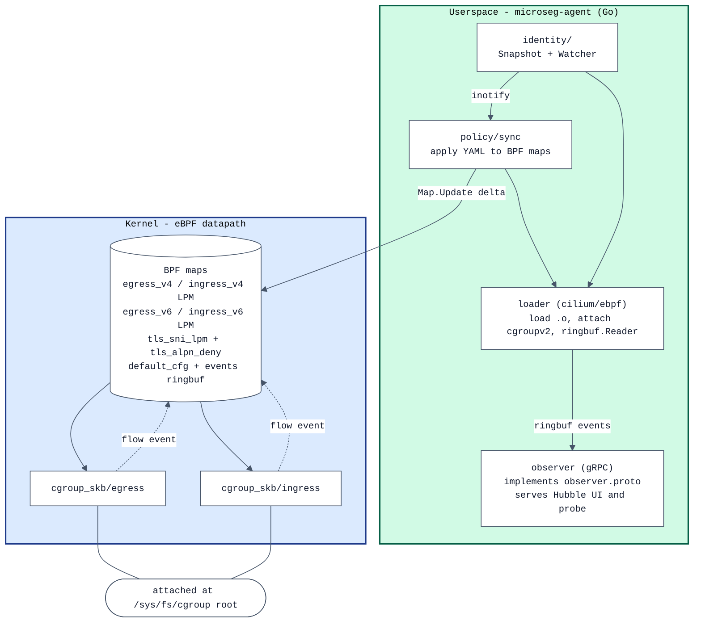
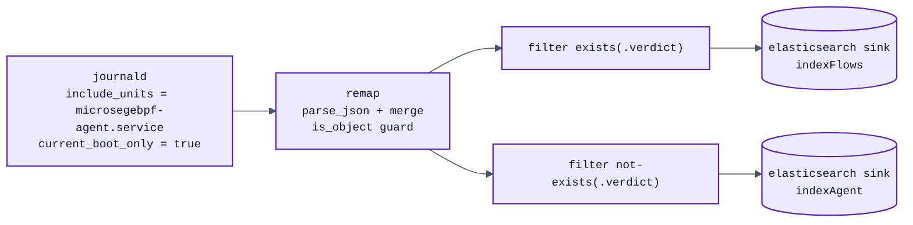
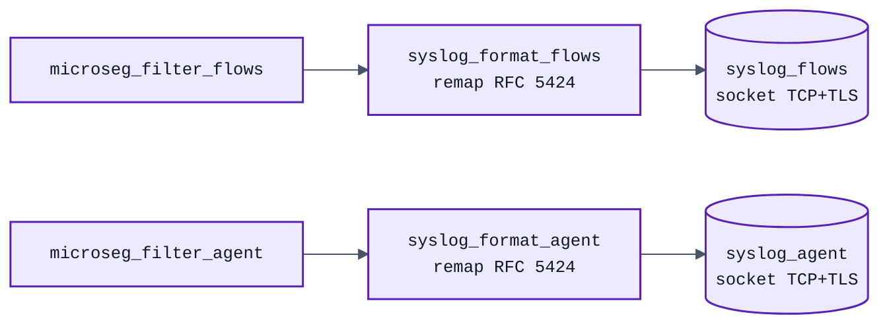

# Architecture

[English](ARCHITECTURE.md) · [Français](ARCHITECTURE.fr.md)

This document explains the internal design of `nixos-microsegebpf` —
why each component exists, how data flows through the system, and the
non-obvious decisions that shape the codebase. It is intended for
contributors and security engineers who want to audit or extend the
agent.

For an end-user overview, see [README.md](README.md).

---

## 1. The problem we are solving

The starting question was: *can we put Cilium-style identity-aware
microsegmentation on a single Linux workstation?* Two existing tools
were the obvious candidates and were ruled out before we wrote any code:

- **Cilium itself** assumes Kubernetes. Its identity model is built on
  pod labels resolved by a Kubernetes API server; its datapath attaches
  to pod veth interfaces created by the CNI plugin; its policy engine
  works on `CiliumNetworkPolicy` CRDs allocated identities through an
  etcd KVStore. Stripped of those, Cilium has no notion of "what is
  this packet's local endpoint?" on a workstation.

- **Tetragon**, Isovalent's bare-metal extraction of Cilium, was a
  closer fit. It runs standalone, watches a `TracingPolicy`, and uses
  the same `cilium/ebpf` Go library. But Tetragon's enforcement
  surface is **syscall-level**: a `kprobe` on `tcp_connect` plus
  `SIGKILL` or return-value override. There is no packet datapath in
  the Tetragon source tree (`bpf/process/`, `bpf/cgroup/`, no
  `bpf_lxc.c`/`bpf_host.c` equivalent). It is not a firewall, it is a
  runtime security observability tool. The two are complementary, not
  substitutable.

The gap, then: a packet-level enforcement layer that uses *workstation*
identity primitives (cgroupv2 id, systemd unit, uid) instead of
Kubernetes labels, and that can be observed with the same tooling
operators already know — Hubble UI.

`nixos-microsegebpf` is exactly that gap.

## 2. Top-level architecture



Two attach points (egress + ingress) on the cgroupv2 root mean every
process on the host inherits the policy. The map-of-LPMs structure
keeps userspace simple: one `Update()` per `(cgroup, dst, port,
proto)` tuple instead of nested maps.

## 3. The eBPF datapath in detail

### 3.1 Why `cgroup_skb` rather than TC or XDP

Three candidates were considered:

| Hook | Pros | Cons | Verdict |
|---|---|---|---|
| **TC ingress/egress** on each interface | Long-established, supported on every kernel | Doesn't natively know the local cgroup; need `bpf_sk_lookup_tcp` + reverse-walk; have to attach per interface (lo, wlan0, virtual ones) | Rejected — too much glue |
| **XDP** | Fastest path | Egress-only via egress hook; doesn't know cgroup; overkill for workstation traffic volumes | Rejected |
| **cgroup_skb/{ingress,egress}** | Knows local cgroup natively (`bpf_skb_cgroup_id`); one attach for all interfaces; covers `lo` (useful for IPC); inherits down the cgroupv2 hierarchy | Slightly higher per-packet cost than TC/XDP | **Chosen** |

For a workstation pushing well under 10 Gbps, `cgroup_skb` is the right
trade. It also gives us a clean way to scope policy to a sub-cgroup
later (you can attach an additional program to a specific
`firefox.service` cgroup if you want overrides) without changing the
overall architecture.

### 3.2 LPM key layout

The eBPF map type is `BPF_MAP_TYPE_LPM_TRIE`. Each entry's key is a
packed struct:

```c
struct lpm_v4_key {
    __u32 prefix_len;   // bits to match starting AFTER this field
    __u64 cgroup_id;    // exact-match part (8 bytes)
    __u16 peer_port;    // exact-match part (2 bytes, network byte order)
    __u8  protocol;     // exact-match part (1 byte)
    __u8  ip[4];        // CIDR-match part (variable)
} __attribute__((packed));
```

An LPM trie matches the first `prefix_len` bits of `key + 4 bytes`
(skipping the `prefix_len` field itself). To force exact match on
`(cgroup_id, peer_port, protocol)` while allowing a CIDR on the IP, we
set:

```
prefix_len = 88 + ip_prefix
              ^    ^
              │    └── 0..32 (v4) or 0..128 (v6)
              └─── exact: 64 + 16 + 8 = 88 bits of header
```

This works because LPM is purely bitwise, prefix-from-MSB. The header
fields occupy bits 0..87 and must match exactly; the IP occupies bits
88+ and is matched up to `ip_prefix` more bits. Longest-prefix wins,
so a `/32` entry naturally takes precedence over a `/24` entry over a
`/0` entry — the policy author gets least-surprising semantics for
free.

The same scheme works for IPv6 with `ip[16]` and prefix lengths up to
`88 + 128 = 216`.

### 3.3 The ring buffer for flow events

The verdict is applied in-kernel without a userspace round-trip — but
we still want every packet to surface in Hubble. The eBPF program
reserves a record on `BPF_MAP_TYPE_RINGBUF` (1 MiB), populates it with
the 5-tuple + verdict + cgroup + policy id, and submits. If the buffer
is full (slow consumer), `bpf_ringbuf_reserve` returns NULL and we
silently drop the *event* without affecting the *packet's verdict*.

Two configurable knobs control event volume:

- `microseg_cfg.emit_allow_events` (default: 0) — when zero, only DROP
  and LOG verdicts produce events. ALLOW packets still flow through
  the verdict path, but are not visible in Hubble. This is the
  production setting; on a busy host emitting an event per packet
  saturates the ring.
- `microseg_cfg.default_egress_verdict` / `default_ingress_verdict` —
  the verdict applied when no LPM entry matches. Defaults to ALLOW
  for both directions, making the agent observe-only until policies
  are explicitly opted into.

### 3.4 Why `__attribute__((packed))`

Without it, GCC/clang would insert padding to align `cgroup_id` to
8 bytes, breaking the LPM key layout that userspace constructs. The
packed attribute is mandatory; both ends agree on the wire format.

### 3.5 Why `BPF_F_NO_PREALLOC`

LPM tries cannot be preallocated. `BPF_F_NO_PREALLOC` is required by
the kernel, otherwise the map creation fails with `EINVAL`.

## 4. Userspace: how a YAML policy becomes a BPF map entry

The pipeline is `pkg/policy/sync.go::Apply()`:

1. **Walk cgroup tree.** `identity.Snapshot()` does a single recursive
   `WalkDir` of `/sys/fs/cgroup`, calling `Stat` on each directory to
   read its inode (= the value `bpf_get_current_cgroup_id()` returns).
   Each directory becomes a `Cgroup{ID, Path, SystemdUnit}` record.
   The systemd unit is extracted by looking at the last path component
   for known suffixes (`.service`, `.scope`, `.socket`, ...).

2. **Resolve selectors.** For each `PolicyDoc` in the loaded YAML, we
   filter the cgroup snapshot:
   - `selector.systemdUnit: firefox.service` matches every cgroup whose
     unit name globs to `firefox.service`
   - `selector.cgroupPath: /user.slice` matches every cgroup whose path
     starts with `/user.slice/` (or is exactly that path)

3. **Expand rules.** For each `(cgroup, rule)` pair, we expand into
   one BPF map entry per `(port, protocol)`. A port range `8000-8099`
   produces 100 entries × `len(protocols)`. A safety guard rejects any
   single rule that would emit more than `maxExpansion = 16384`
   entries — otherwise a "block 0.0.0.0/0 ports 1-65535" mistake
   would explode the map.

4. **Push to BPF maps via delta reconciliation.** Each entry's
   `lpm_v?_key` is built with the correct `prefix_len`. The syncer
   then runs a generic `applyDelta[K comparable]` reconciler over
   each of the six maps (`egress_v4`, `ingress_v4`, `egress_v6`,
   `ingress_v6`, `tls_sni_lpm`, `tls_alpn_deny`):

   1. Snapshot the current map content into a Go map.
   2. For every desired entry whose value differs (or is missing),
      issue a single `Map.Update(&key, &val, UpdateAny)` — atomic
      at the kernel level (RCU). Entries with identical value are
      not touched at all.
   3. After all adds/updates land, delete keys that were in the map
      but absent from the new desired set.

   This adds-first, deletes-last order is the **no-coupure
   guarantee**: there is no transient window where a flow that
   matches both the old and the new policy sees a missing entry.
   At steady state (no policy change between two ticks) the
   reconciler issues zero syscalls per map. The previous
   flush-then-fill pattern is gone — see
   `pkg/policy/sync.go::applyDelta` for the implementation.

### 4.1 The "any port" sentinel

A rule with no `ports:` field is supposed to match any L4 port. LPM
exact-matching on the port field would require us to insert 65535
entries, which is silly. Instead, we insert one entry with `port=0`
and adjust the `prefix_len` to skip the port field entirely:

```
prefix_len = 64 (cgroup) + 8 (proto) + ip_prefix     // skips port
```

The lookup side knows nothing about this — it always builds a key with
the actual peer port, prefix_len = 88 + 32. The trie returns the most
specific match: a port-aware entry wins over the wildcard one,
because of LPM semantics.

### 4.2 Hot reload via inotify

The original PoC used a 5-second periodic re-resolution. That's fine
in steady state but laggy when a user logs in (dozens of new cgroups
created in a few hundred milliseconds for `user@1000.service`,
`session-N.scope`, every transient unit, ...).

`pkg/identity/watcher.go` replaces the timer with a real
`inotify`-based watcher. Two goroutines collaborate:

- `readLoop` is a tight drain on the inotify file descriptor. For
  every event it identifies whether it concerns a cgroup directory
  creation/deletion (via `IN_ISDIR`), updates the watch set, and
  signals an internal raw channel.
- `debounceLoop` collapses bursts: it resets a 250 ms timer on each
  raw signal and emits one wake-up on the public `Events()` channel
  when the timer fires. A user login that creates 30 cgroups in
  150 ms produces a single wake-up.

The agent's policy syncer subscribes to `Events()` and triggers an
`Apply()` on each wake-up. A slow safety-net ticker (`-resolve-every
60s`) still runs in case inotify ever drops an event (it has a kernel
queue limit; under sustained pressure events can be dropped).

### 4.3 Why two goroutines instead of one

The naive approach is one goroutine that does a `select` over
`unix.Read(fd)` and a `time.Timer.C`. This is broken: `unix.Read` is a
blocking syscall, not a Go channel operation, so the `select` can't
multiplex over it. The timer never fires until Read returns. The
debounce window degenerates to "one event per file descriptor activity
burst", which we already have without the extra code.

Splitting reader from debouncer gives us proper concurrency. The
reader blocks in `Read`; closing the fd from `Close()` breaks it out
with `EBADF`.

### 4.4 Why the watcher fans out to multiple subscribers

The watcher exposes `Subscribe() <-chan struct{}` rather than a
single shared `Events` channel. Two consumers care about the cgroup
tree changing:

  * the **policy syncer** — needs to re-resolve selectors and update
    the BPF maps so the new cgroup's traffic gets the right verdict;
  * the **unit cache** — needs to refresh its cgroup_id → systemd
    unit mapping so flow events surface the right `unit=...` label.

The first PoC pointed both at the same buffered channel
(`make(chan struct{}, 1)`) and shipped. CI then exposed the
consequence: **a Go channel delivers each send to exactly one
receiver**, so the two consumers raced on every wake-up. Half the
time the unit cache won — the events would carry the correct unit
name but the BPF map would still hold the old policy set, the new
cgroup wasn't in it, and `policy_id=0` (default-allow) would leak
through. That's the failure mode that ate four CI runs before the
diagnosis.

`Subscribe()` returns a fresh per-caller channel. `debounceLoop` ends
each quiet period by calling `broadcast()`, which iterates over every
registered subscriber and does a non-blocking send on each. A slow
subscriber drops its own event without back-pressuring the others;
fast subscribers keep up.

The pitfall on the consumer side: call `Subscribe()` **once** before
the consumer's `for { select { ... } }` loop. Calling it inside the
loop body would append a fresh subscriber on every iteration and
leak channels indefinitely.

### 4.5 FQDN resolution cache (security-relevant)

`host:` rules go through `Syncer.resolveRuleTargets`, which calls
`net.DefaultResolver.LookupIPAddr` with a 2-second context timeout.
Without caching, every Apply tick re-issues the resolver query —
doubling the resolver-poisoning attack surface (a malicious DNS
response between two ticks flips the `/32` LPM entry to whatever
IP the attacker chose).

The syncer holds an in-process map keyed on the FQDN with a TTL
honoured at lookup time:

```go
type dnsCacheEntry struct {
    nets    []*net.IPNet
    expires time.Time
}
```

Defaults to TTL=60s (`-dns-cache-ttl=60s` flag on the agent,
`services.microsegebpf.dnsCacheTTL` option). `0s` disables the
cache entirely (debugging). Slot lifecycle:

1. **Cache hit** (`time.Now().Before(e.expires)`) → return a copy of
   `e.nets` to the caller. The IPNet pointers are immutable so we
   share them; we copy the slice so the caller's `append` doesn't
   mutate the cached entry.
2. **Cache miss / expired** → resolve, store the result, return.
3. **Resolver failure** → if a stale entry exists, log a WARN and
   reuse it for one more cycle. Stale-while-error keeps a known-good
   FQDN rule enforcing through a transient resolver outage; without
   this fallback, a 30-second resolver hiccup would flush every
   `host:` LPM entry from the maps.

The cache lives in `Syncer` (one per agent) and is mutex-protected by
the same `s.mu` that `Apply()` already holds for the whole
reconciliation. No additional lock is needed; the read and write paths
are inside the critical section. `SetDNSCacheTTL` wipes the cache so
a TTL change takes effect immediately rather than waiting for the
oldest stale entry to expire naturally.

This does not replace DNSSEC. The agent still trusts the upstream
resolver; the cache narrows the *time window* an attacker has to
poison the answer. Operators who want stronger guarantees should
combine this project with a local DNSSEC-validating resolver (e.g.
`unbound`).

## 5. The Hubble observer

`pkg/observer/server.go` implements three RPCs of the
`cilium.observer.Observer` service:

- `ServerStatus` — total flow count, max ring size, uptime, "1
  connected node"
- `GetNodes` — one `Node` entry with the local hostname and
  `NODE_CONNECTED` state
- `GetFlows(stream)` — replays the recent flow buffer (oldest first,
  up to `limit`), then optionally tails live new flows forever

The other RPCs in the proto file (`GetAgentEvents`, `GetDebugEvents`,
`GetNamespaces`) return `Unimplemented`. Hubble UI degrades cleanly:
the agent-events log panel is empty, the namespace selector shows only
"microseg", everything else works.

The flow conversion (`pkg/observer/flow.go::ToFlow`) constructs a real
`flow.Flow` protobuf with two endpoints. The local cgroup becomes
either `Source` or `Destination` depending on direction; the remote
peer is always a `world` endpoint with reserved identity 2 (Cilium's
`RESERVED_IDENTITY_WORLD`). The cgroup is given a deterministic
identity by hashing its id with FNV-32a, so the same systemd unit gets
a stable identity across agent restarts. Labels are set so Hubble UI
can group flows in the service map:

```
microseg.cgroup_id=12345
microseg.unit=firefox.service
k8s:io.kubernetes.pod.namespace=microseg   # pacifies hubble-ui's namespace logic
```

The "pod name" field is set to the systemd unit name, so the service
map shows `firefox.service` as a node — the natural visual.

### 5.1 Subscriber back-pressure

Each connected `GetFlows` stream gets a buffered channel (256 entries).
When the publisher pushes a flow, it `select` with `default` on each
subscriber's channel — slow consumers drop events without slowing the
agent. Hubble UI itself behaves the same way; this is not a
regression.

### 5.2 Transport security: TLS / mTLS for the gRPC observer

Default deployment uses `unix:/run/microseg/hubble.sock` with
`RuntimeDirectoryMode = 0750` — only root on the workstation can
connect. No TLS needed; the kernel mediates.

When the operator switches to a TCP listener (`hubble.listen =
"0.0.0.0:50051"`), the agent accepts an optional TLS configuration:

```go
type TLSConfig struct {
    CertFile      string  // server cert (PEM)
    KeyFile       string  // server key (PEM)
    ClientCAFile  string  // CA bundle for verifying client certs (mTLS)
    RequireClient bool    // require + verify a valid client cert
}
```

The server-side knobs are wired through `-hubble-tls-cert`,
`-hubble-tls-key`, `-hubble-tls-client-ca`, `-hubble-tls-require-client`
flags on the agent (and the matching `services.microsegebpf.hubble.tls.*`
options in the NixOS module). When `CertFile` + `KeyFile` are both set,
`Server.Serve` wraps the listener with `grpc.Creds(credentials.NewTLS(...))`
using TLS 1.2+ minimum. When `ClientCAFile` is also set:

- `RequireClient = true` → `tls.RequireAndVerifyClientCert` (mTLS, hard)
- `RequireClient = false` → `tls.VerifyClientCertIfGiven` (mTLS, optional)

Two complementary warnings prevent silent cleartext exposure:
- The NixOS module emits an evaluation-time warning when `hubble.listen`
  is TCP and `hubble.tls.{certFile,keyFile}` is unset.
- The agent emits a runtime slog WARN at startup with the same wording.
  Even if the operator bypasses the module (`microseg-agent` invoked
  directly from the CLI), the warning surfaces.

The `microseg-probe` CLI mirrors the client side: `-tls-ca`,
`-tls-cert`, `-tls-key`, `-tls-server-name`, `-tls-insecure`. The
default ServerName is the host portion of `-addr`, which matches the
typical SAN pattern. `buildClientCreds` enforces `MinVersion =
TLS 1.2`; setting `-tls-insecure` prints a stderr warning.

Both sides leave the system trust store as fallback (no `-tls-ca` →
verify against `/etc/ssl/certs/`). The dual `-tls-ca` /
`-tls-cert+-tls-key` combination supports any internal CA + mTLS
setup with no additional config tooling.

Tested matrix in the dev VM:

| Probe config | Result |
|---|---|
| Valid CA + valid client cert + correct ServerName | ✅ ServerStatus + GetNodes + GetFlows |
| Valid CA, no client cert | ❌ `tls: certificate required` (mTLS rejection) |
| No TLS at all (plain TCP) | ❌ `error reading server preface: EOF` |

## 6. NixOS module

`nix/microsegebpf.nix` is a standard NixOS module with `services.microsegebpf.*`
options. Two pieces are worth highlighting:

- **systemd hardening** mirrors ANSSI workstation guidance:
  `CapabilityBoundingSet` is reduced to the four caps the agent
  actually needs (`CAP_BPF`, `CAP_NET_ADMIN`, `CAP_PERFMON`,
  `CAP_SYS_RESOURCE`), `NoNewPrivileges=true`, `ProtectSystem=strict`,
  `SystemCallFilter` allows only `@system-service @network-io bpf`,
  and `ReadWritePaths` is limited to `/sys/fs/bpf`. The agent runs as
  `root` in the strict sense (it must, to attach cgroup_skb at the
  unified hierarchy root) but cannot do anything *else* root could do.

- **Two-phase enforcement.** The module defaults to `enforce = false`,
  which warns the operator and effectively turns the agent into an
  observability-only tool: drop verdicts in policies are loaded into
  the BPF maps but the operator hasn't given consent for them to
  bite. The intent is to flip `enforce = true` only after a few weeks
  of watching the Hubble UI and confirming the policy bundle doesn't
  break legitimate flows.

The optional `services.microsegebpf.hubble.ui.enable` brings up the
upstream `quay.io/cilium/hubble-ui` image as an
`oci-containers.containers` entry, pointed at the agent's gRPC
socket. No relay, no cluster, no certificates — just a local
`http://localhost:12000` URL on the workstation.

## 7. Build system idiosyncrasies

A few non-obvious choices in `shell.nix` and `nix/package.nix` are
worth flagging because they were the result of debugging cycles, not
first-principle design:

- **`hardeningDisable = [ "all" ]`** in `shell.nix`: nixpkgs' clang
  wrapper injects flags like `-fzero-call-used-regs=used-gpr` and
  `-fstack-protector-strong` that clang refuses (or silently drops with
  a warning) when targeting `bpfel`. Disabling all hardening flags
  unblocks `bpf2go`.
- **`CGO_ENABLED=0`** in `shell.nix`: the `bpf/` Go package contains a
  `.c` file (the eBPF source). Go's compiler refuses to compile a
  package that has `.c` files without `import "C"`, *unless* CGO is
  disabled, in which case it ignores them entirely. We don't need
  CGO for anything else (`cilium/ebpf` is pure Go), so disabling it is
  free.
- **`overrideModAttrs = (_: { preBuild = ""; })`** in
  `nix/package.nix`: `buildGoModule` constructs a `goModules`
  intermediate derivation that vendors dependencies. By default it
  inherits the parent's `preBuild`, which tries to run `bpftool` and
  `clang` — completely irrelevant for vendoring. Overriding to an
  empty `preBuild` keeps the modules step lean and avoids dragging
  the whole BPF toolchain into a derivation that doesn't need it.
- **Pre-generated BPF artefacts for Nix.** The Nix sandbox has no
  access to `/sys/kernel/btf/vmlinux`, so the agent's `preBuild`
  cannot regenerate `bpf/vmlinux.h` and `bpf/microseg_bpfel.{go,o}`.
  The build expects them to be present in the source tree, produced
  by `make generate` outside the sandbox. This is a slightly awkward
  workflow but avoids vendoring a 2.6 MB header for every supported
  kernel.

## 8. What's deliberately not implemented

Each item below was considered and consciously left out of the PoC.

- **L7 awareness** (HTTP, gRPC, Kafka, DNS). Cilium implements L7 via
  an Envoy sidecar; that's a substantial extra runtime and
  workstation traffic rarely justifies it.
- **TLS interception.** Out of scope and against the spirit of
  workstation hardening.
- **DNS-policy.** "Block these hostnames" is a different problem
  domain — solve it with a separate DNS-aware tool (a stub resolver,
  a content filter). `nixos-microsegebpf` works on resolved IPs.
- **IPv6 fragments / IPv4 fragments after the first.** First fragment
  carries the L4 header and is policed; trailing fragments are
  forwarded. Workstation traffic almost never fragments here.

## 9. TLS-aware peeking: SNI + ALPN matching

The L3/L4 datapath alone has a known blind spot: CDNs serve thousands
of sites from the same IPs, so an IP-only deny either over-blocks or
misses the target. microsegebpf augments the L3/L4 verdict with a
peek-only TLS parser. We never decrypt anything; we only inspect the
two extensions of the ClientHello that carry the destination's name
and the negotiated application protocol.

### 9.1 Where the TLS check fits in the verdict pipeline

After the LPM lookup runs (handle_v4 / handle_v6), the agent has an
in-progress verdict. The TLS check fires only when:

- the IP-level verdict is *not already DROP* (a DROP from the LPM
  always wins; we don't waste cycles peeking)
- the direction is egress (we don't care about TLS we serve)
- the protocol is TCP and the destination port is 443 or 8443
- the TCP `doff` field looks sane (≥ 5)

If those gates are satisfied, the parser is invoked with the offset
and length of the TCP payload. A returned `V_DROP` overrides the
in-progress allow verdict and the policy_id is stamped with the
sentinel `0xFFFFFFFE` so a flow event makes the TLS-origin of the
drop visible in Hubble.

### 9.2 Map design

Two BPF maps with deliberately different shapes:

```
tls_sni_lpm   : LPM_TRIE  on the reversed SNI hostname  -> policy_value
                  (struct { u32 prefix_len; u8 name[256]; })
tls_alpn_deny : HASH      on FNV-1a 64-bit of ALPN identifier -> policy_value
```

#### SNI: LPM trie on reversed bytes (Cilium FQDN trick)

DNS hierarchy nests right-to-left (`mail.example.com` is "the `mail`
in `example.com`"), so reversing the byte order lets a longest-prefix
match in the LPM trie do wildcard matching for free. Two pattern
flavours, distinguished by their terminator byte:

| Pattern | Stored bytes | prefix_len |
|---|---|---|
| `example.com`           (exact)    | `moc.elpmaxe\0` | 96 bits |
| `*.example.com`         (wildcard) | `moc.elpmaxe.`  | 96 bits |

The lookup reverses + lowercases the on-wire SNI (the kernel-side
lowercase keeps userspace policy authoring case-agnostic, RFC 6066 §3
makes this safe), pads it to 256 bytes, and asks the trie for the
longest match.

Why two terminators? Without them, exact `example.com` would catch
every subdomain too. The `\0` after the reversed exact bytes diverges
from the lookup's natural `.` (or any other character) at byte 11,
killing the false match. The `.` after the reversed wildcard bytes
enforces a label boundary so `evilexample.com` (reversed:
`moc.elpmaxelive`) doesn't match `*.example.com`.

Multi-level wildcards (`*.*.foo.com`) are rejected at parse time —
no DNS standard exists for two-label SNI wildcards, and modelling
them in the LPM design would be ambiguous.

#### ALPN: FNV hash because the vocabulary is finite

ALPN identifiers are short fixed strings (`h2`, `http/1.1`, `h3`,
`imap`, `smtp`, ...) and never wildcarded. A 64-bit FNV-1a hash
keyed HASH map is cheaper and good enough; collisions in a 64-bit
space with < 10 K entries are around 10⁻¹¹ probability.

The userspace `fnv64a()` in `pkg/policy/sync.go` is the byte-for-byte
twin of the BPF helper of the same name. Drift = silent miss; both
functions carry a comment demanding lockstep changes.

#### Per-CPU scratch for the SNI LPM key

A 256-byte LPM key + a 256-byte work buffer would blow the 512-byte
BPF stack budget. The key lives in a `BPF_MAP_TYPE_PERCPU_ARRAY` of
size 1; the parser looks it up at the top of `sni_lpm_check`, zeroes
it (a stale name suffix from a previous packet would corrupt the
lookup), and passes a pointer to it through the `bpf_loop` callback
context. The `bpf_loop` reverses the on-wire bytes into the key's
`name` field in place.

#### Two verifier subtleties that bit during implementation

  1. **Bound propagation through arithmetic**. The reversal index
     `j = src_len - 1 - i` is computed from a map-loaded `src_len`,
     so the verifier sees it as an unbounded scalar — even an
     `if (j >= 256) return 0;` check doesn't propagate cleanly to
     the array store. The fix is an unconditional `j &= 255` mask:
     semantically a no-op for valid inputs (the caller already
     checks `src_len <= 256`), load-bearing for the verifier.

  2. **Lookup `prefix_len` semantics**. The LPM kernel implementation
     only considers entries whose `prefix_len <= lookup.prefix_len`.
     A first attempt set the lookup's `prefix_len` to the SNI's
     actual byte length — that excluded every entry with a longer
     prefix (e.g. exact pattern `example.com\0` has `prefix_len=96`,
     but a lookup for SNI `example.com` would set lookup
     `prefix_len=88`, missing the entry). Fix: always set the
     lookup `prefix_len` to `MAX_SNI_NAME_BYTES * 8` so every
     populated entry is reachable; the trie still picks the longest
     match.

### 9.3 The parser

`tls_check()` in `bpf/microseg.c` is a state machine over
`bpf_skb_load_bytes` calls. We deliberately do not use
`data` / `data_end` pointer arithmetic — chaining variable-length
TLS fields through pointer comparisons is exactly the verifier
nightmare we want to avoid.

Walk:

1. Read the 5-byte TLS record header. Reject if `type != 0x16` or
   the major version isn't `0x03`.
2. Read the 4-byte handshake header. Reject if `msg_type != 0x01`
   (ClientHello).
3. Skip `client_version (2) + random (32) = 34 bytes`.
4. Skip `legacy_session_id` using its 1-byte length prefix.
5. Skip `cipher_suites` using its 2-byte length prefix.
6. Skip `legacy_compression_methods` using its 1-byte length prefix.
7. Read the 2-byte `extensions_length`.
8. Iterate the extensions block via `bpf_loop`, calling
   `walk_extension` once per extension, capped at
   `MAX_TLS_EXTENSIONS = 16`.

Per extension, `walk_extension` dispatches on the type:

- `0x0000` SNI: read the first entry's `name_type` (must be 0,
  host_name) and `name_length`, then hash the hostname into a u64
  via `fnv64a`. Look up in `tls_sni_lpm`. On match, set
  `ctx->verdict = V_DROP` and return 1 to break the loop.
- `0x0010` ALPN: read the first entry's length and hash the
  protocol name. Look up in `tls_alpn_deny`. PoC inspects only the
  first ALPN entry — see §9.5 below for why.

### 9.4 Why bpf_loop instead of #pragma unroll

The first version of the parser used `#pragma unroll` on a 32-iter
extension loop and a nested 8-iter ALPN loop. That fails verifier
loading with:

```
verifier rejected program: cannot allocate memory:
    insn 4075 cannot be patched due to 16-bit range
    processed 313490 insns (limit 1000000)
```

The error isn't the instruction limit — it's BPF's internal jump
patching, which uses signed 16-bit offsets. With everything inlined
the resulting basic blocks are too large to address with a single
jump.

`bpf_loop` (kernel ≥ 5.17) sidesteps this entirely: the verifier
sees one callback function and one indirect call, regardless of
iteration count. The kernel handles the loop counter at runtime.
Dropping #pragma unroll and routing both extension iteration and
FNV byte hashing through `bpf_loop` cuts the verifier's instruction
count by an order of magnitude and avoids the patch-range problem
altogether.

### 9.5 What the parser deliberately doesn't do

- **Multiple ALPN entries.** The walker reads only the first
  protocol in the ALPN list. Catches single-purpose clients
  (an `h2`-only beacon will be dropped if `h2` is in `alpnDeny`)
  but a malicious client sending `["h2", "x-evil"]` with `x-evil`
  second slips through. Extending to N entries would re-introduce
  the verifier complexity we just fought.
- **Multiple SNI entries.** RFC 6066 allows multiple
  `server_name_list` entries, but in practice every client sends
  exactly one. We read only the first.
- **Fragmented ClientHello.** First TCP segment is assumed to
  contain the whole `extensions` block. In practice browsers fit
  this in ~500 bytes, well under any MTU. Exotic clients sending
  16 KiB of PSK extensions across multiple segments slip through.
- **TLS 1.3 ECH (Encrypted Client Hello).** When negotiated, the
  inner SNI is encrypted and our parser sees only the outer SNI
  (typically a generic public name like `cloudflare-ech.com`).
  This is the long-term structural threat to SNI-based filtering;
  there is no in-kernel workaround.
- **Per-cgroup TLS scoping.** Map keys are `u64` (the hash) only,
  not `(cgroup_id, hash)`. SNI denies are therefore global to the
  host. Adding a cgroup_id to the key is a clean follow-up but
  doubles the key size and doubles the verifier complexity for the
  parser.

### 9.6 The verdict precedence rule

Final verdict computed at the end of handle_v4 / handle_v6:

```
if LPM verdict == DROP        -> packet drops (TLS not consulted)
elif TLS check returns V_DROP -> packet drops, policy_id = sentinel
else                          -> verdict from LPM (typically ALLOW)
```

This is intentional. An IP-level drop is cheaper, more deterministic
and more authoritative; we don't want a TLS check to revive a drop
verdict. Conversely, an IP-level allow can still be vetoed by TLS —
that's the whole point of the augmentation.

## 10. Operational integration: log shipping to OpenSearch

A workstation that drops a flow at 03:14 should not require an
analyst to SSH in and grep journald to find out. The optional
`services.microsegebpf.logs.opensearch.*` block centralises every
flow event and every control-plane log into a fleet-wide
OpenSearch cluster, where the SOC already has retention and
alerting wired up.

### 10.1 Why a separate process, not the agent

The agent is on the eBPF datapath: any extra HTTP client, TLS
stack, or retry loop in its address space increases its blast
radius and the probability that a log-pipeline outage takes the
enforcement down with it. So the agent stays narrow:

- writes structured JSON to **stdout** (one line per flow event,
  the high-volume stream)
- writes slog control-plane records to **stderr** (low-volume,
  human-meaningful)
- never opens an outbound network connection of its own

systemd's stream-capture for `Type=simple` units sends both file
descriptors into journald with `_SYSTEMD_UNIT=microsegebpf-
agent.service`, where any sidecar can pick them up.

### 10.2 The shipper unit

`services.microsegebpf.logs.opensearch.enable = true` adds a
second systemd unit, `microsegebpf-log-shipper.service`, running
[Vector](https://vector.dev) under `DynamicUser=true`. The
Vector config is generated by Nix as a JSON file in the store —
reviewable as part of any closure diff, byte-identical between
two evaluations of the same input.

Pipeline (four nodes):



- **Source `microseg_journal`** — `journald` source restricted to
  `include_units = [ "microsegebpf-agent.service" ]`,
  `current_boot_only = true`. We never ship anything we shouldn't.
- **Transform `microseg_parse`** — VRL `remap` that does
  `parse_json(.message)` and merges the parsed object into the
  event root. Non-JSON lines (rare; only if the agent panics
  before slog initialises) pass through unchanged. The `is_object`
  guard + `object!()` cast keeps VRL's strict assignment checker
  happy without a runtime fallback.
- **Filters `microseg_filter_flows` / `microseg_filter_agent`** —
  two `filter` transforms splitting on `exists(.verdict)`. Two
  filters instead of a single `route` because `route` always
  exposes an `_unmatched` output that Vector warns about when no
  consumer is wired.
- **Sinks `opensearch_flows` / `opensearch_agent`** — two
  `elasticsearch` sinks (the OpenSearch wire format is
  Elasticsearch-compatible) writing to the configured
  strftime-templated indices in bulk mode.

### 10.3 Auth + TLS handling

The OpenSearch password never appears on the unit's command line
or in its environment file. systemd's `LoadCredential =
"os_password:${cfg.logs.opensearch.auth.passwordFile}"` places
the file in `$CREDENTIALS_DIRECTORY`, an `ExecStartPre` hook
exports it as `MICROSEG_OS_PASSWORD`, and Vector's
`${MICROSEG_OS_PASSWORD}` substitution wires it into the sink
auth config at start time only.

CA pinning via `tls.caFile` is per-sink (so the same file is
splice'd into both `opensearch_flows` and `opensearch_agent`).
Setting `tls.verifyCertificate = false` is permitted but Vector
emits a loud WARN at start — appropriate for a lab, never for
production.

### 10.4 Hardening of the shipper

The shipper unit needs network egress to OpenSearch and read
access to journald. Nothing else, so we drop everything else:

| Knob | Value | Why |
|---|---|---|
| `DynamicUser` | `true` | No persistent UID; systemd allocates one per boot |
| `StateDirectory` | `vector` | Vector requires a `data_dir` for buffer checkpoints; `StateDirectory` makes it work under `DynamicUser` (auto bind-mount of `/var/lib/private/vector` → `/var/lib/vector`) |
| `SupplementaryGroups` | `[ "systemd-journal" ]` | Read access to `/var/log/journal/*` |
| `ProtectSystem` | `strict` | `/usr`, `/etc`, `/boot` read-only |
| `RestrictAddressFamilies` | `[ AF_INET AF_INET6 AF_UNIX ]` | Block raw sockets, netlink, packet sockets |
| `SystemCallFilter` | `[ @system-service @network-io ]` | Only the syscalls a network client needs |
| `LockPersonality` | `true` | No personality(2) tricks |
| `MemoryDenyWriteExecute` | `false` | Vector JIT-allocates regex engines etc.; can't be true |
| `NoNewPrivileges` | `true` | The unit cannot escalate via setuid binaries |

### 10.5 Decoupling guarantees

Three failure modes the design defends against:

1. **OpenSearch cluster down.** Vector retries with exponential
   backoff. The agent and its eBPF datapath keep enforcing —
   they are unaware of OpenSearch.
2. **Shipper unit crash.** journald keeps buffering everything
   the agent writes (per its own retention budget). When the
   shipper restarts, the journal cursor (persisted in
   `/var/lib/vector/`) tells Vector where to resume. No event
   loss as long as journald didn't rotate past the cursor.
3. **Vector config typo at deploy time.** `nix flake check`
   catches eval errors; the runtime `vector validate` catches
   VRL/sink errors before the unit goes active. A bad config
   keeps the *previous* generation's shipper running until
   `nixos-rebuild switch` succeeds (NixOS atomic activation).

There is no path where a log-pipeline outage takes down the
enforcement.

### 10.6 Alternate destination: syslog (RFC 5424 over TLS)

The same shipper unit also speaks syslog. Both sinks are
independent — `logs.opensearch.enable` and `logs.syslog.enable`
can be true together, in which case the single Vector instance
maintains four output sinks (two OpenSearch bulk + two syslog
socket) reading from the same parse + filter chain.

Why two output protocols? OpenSearch is the searchable historical
store; syslog is the SOC's incident-response ingest path. The
typical deployment enables both: OpenSearch for the analyst
running ad-hoc queries, syslog for the SIEM's correlation rules
and on-call paging.

Pipeline (added to the existing flows / agent split):



Wire format:

```
<PRI>1 TIMESTAMP HOSTNAME APP-NAME - - - JSON-BODY
```

`PRI = facility * 8 + severity`. Facility is bound at evaluation
time from `logs.syslog.facility{Flows,Agent}` (default `local4`
for verdicts, `daemon` for control-plane). The multiplication is
constant-folded by Nix so the VRL transform reduces to
`pri = 160 + sev` for the flow stream and `pri = 24 + sev` for
the agent stream.

Severity is computed per event in VRL:

| Stream | Field consulted | Severity |
|---|---|---|
| Flow | `.verdict == "drop"` | 4 (warning) |
| Flow | `.verdict == "log"` | 5 (notice) |
| Flow | `.verdict == "allow"` (or anything else) | 6 (info) |
| Agent | `.level == "ERROR"` | 3 (err) |
| Agent | `.level == "WARN"` | 4 (warning) |
| Agent | `.level == "INFO"` | 6 (info) |
| Agent | `.level == "DEBUG"` | 7 (debug) |

PROCID, MSGID and STRUCTURED-DATA are NIL (`-`) — adding them
would require either capturing the agent's PID at startup
(possible via systemd's `MAINPID` but pointless after the next
restart) or expressing the structured data as a custom IANA
Vendor Private Enterprise number block. Keeping them NIL keeps
the wire format SIEM-friendly without forcing an ID assignment.

**Framing.** RFC 5425 mandates ASCII-decimal octet counting
(`<digits> <space> <payload>`) for syslog-over-TLS. Vector's
socket sink does not implement that exact framing — its
`length_delimited` is binary 4-byte big-endian, not ASCII
decimal. The module therefore defaults to `newline_delimited`,
which all modern syslog daemons (rsyslog `imtcp`, syslog-ng
`network()` driver, Splunk, Wazuh) accept on TLS as a
de-facto extension of the spec. Strict octet-counting is
reachable through `framing = "bytes"` plus a custom VRL
prefix transform via `extraSettings`.

**Insecure modes.** `mode = "tcp"` and `mode = "udp"` are
supported for legacy collectors but trigger a NixOS evaluation-
time warning (printed by `nixos-rebuild`). Flow events name
the workstation that dropped traffic to a specific IP on a
specific port — exactly the inventory an attacker who's
already inside wants. We make the unencrypted choice explicit
in the rebuild log so it is reviewable, not silent.

**mTLS.** When `tls.keyFile` is set, the private key is
bind-mounted into the unit via systemd `LoadCredential`. The
on-disk path can be anywhere readable by root (e.g.
`/etc/ssl/private` mode 0640 root:ssl-cert), the dynamic user
never sees the original file — only the credentials directory
copy at `/run/credentials/microsegebpf-log-shipper.service/syslog_key`.
Encrypted keys are supported via `tls.keyPassFile` (read by
the same LoadCredential machinery, exported as
`MICROSEG_SL_KEY_PASS` for Vector's `tls.key_pass`
substitution).

### 10.7 What about Hubble UI?

Hubble UI and the OpenSearch shipper serve different audiences
and timescales:

| | Hubble UI | OpenSearch shipper |
|---|---|---|
| Audience | Local operator, interactive | Fleet-wide SOC, batched |
| Latency | Live tail (sub-second) | Bulk POST, ~1-5 s |
| Retention | In-memory ring buffer (`hubble.bufferSize`, default 4096 events) | Index lifecycle policy in OpenSearch (weeks-to-months) |
| Cardinality | One host | Whole fleet |
| Wire format | gRPC `cilium.observer.Observer` | HTTP/JSON `_bulk` |

Both are optional, both can run alongside, and they read from
different sources (Hubble from the agent's gRPC server
directly; the shipper from journald). Enabling both is the
recommended production setup — operators get live UI, SOC gets
historical search.

## 11. Where to look first when something breaks

| Symptom | Probable cause | Where to look |
|---|---|---|
| `attach failed: pin egress link: file exists` | Previous agent left a pinned link in `/sys/fs/bpf/microseg`. The current loader removes pins on startup (`os.Remove` in `loader.Attach`); if it still happens, the bpffs path is being held by another process. | `bpftool link show`, then `rm -f /sys/fs/bpf/microseg/*` |
| Drops not enforced even though policy is loaded | Either `services.microsegebpf.enforce = false` (NixOS) or default verdict is `allow` and the rule's selector matched zero cgroups. | Agent log: `policy without matching cgroup` warns at apply time |
| Hubble UI stuck on "Loading flows" | Agent's gRPC server isn't reachable. Check `/run/microseg/hubble.sock` exists, run `microseg-probe -addr=unix:/run/microseg/hubble.sock` to confirm. | `pkg/observer/server.go::Serve` |
| New systemd unit not visible in Hubble after spawn | Inotify event was dropped or the unit cache hasn't refreshed yet. The fallback ticker (`-resolve-every`) catches this after at most one cycle. | `pkg/identity/watcher.go::readLoop` |
| `verifier rejected program` at startup | A change to `bpf/microseg.c` made the verifier unhappy. Check the printed verifier log (it's appended to the load error). Usually a bounds-check missing on `data` / `data_end` accesses. | `pkg/loader/loader.go::Load` |
| Flow events show the right `unit=...` label but `verdict=allow / policy_id=0` even though the policy says `drop` for that unit | Two consumers were both reading the same single `Events` channel and racing — one would get the wake-up, the other would silently miss it. Fixed in §4.4 (Subscribe/broadcast). If it reappears: a new consumer was added without calling `Subscribe()`. | `pkg/identity/watcher.go::Subscribe`, all `cgw.Subscribe()` callers in `cmd/microseg-agent/main.go` |
| `nix flake check` (vm-test) fails with `no ssl_certificate is defined for the listen ... ssl directive` | nginx vhost lists `listen { ssl = true; }` manually but doesn't set `addSSL`/`onlySSL`/`forceSSL`. The NixOS module only wires the cert when one of those flags is set. | `nix/tests/vm-test.nix` peer's nginx config — split into two vhosts, one with `onlySSL = true` |
| GitHub Actions warns `Node.js 20 is deprecated` | Pinned action versions still ship a Node 20 runtime. Either bump (`actions/checkout@v6`, `cachix/install-nix-action@v31.10.4`, `cachix/cachix-action@v17`, `actions/setup-go@v6`) or set `FORCE_JAVASCRIPT_ACTIONS_TO_NODE24=true` in the workflow `env:`. | `.github/workflows/*.yml` |
| vm-test fails with `target.fail(...) unexpectedly succeeded` on an alice-as-user assertion | `su -l alice` in `target.execute()` has no controlling TTY, so PAM doesn't invoke pam_systemd and the curl runs in `/system.slice/backdoor.service` instead of `/user.slice/...`. Use a dedicated `User=alice` `Type=oneshot` systemd unit and select on `systemdUnit = ...`. | `nix/tests/vm-test.nix` |

## 12. Contributing

Patches welcome. Two house rules:

- **Keep the BPF C readable.** The verifier is unforgiving, and so is
  the next person who reads the file. Comment intent over mechanics
  (the bit shifts are obvious; the *reason* they're there is not).
- **No L7 in the datapath.** The whole point of this project is the
  cleanest possible workstation microseg layer. If you need HTTP
  awareness, use Cilium proper or an L7 proxy. We will keep saying no.
