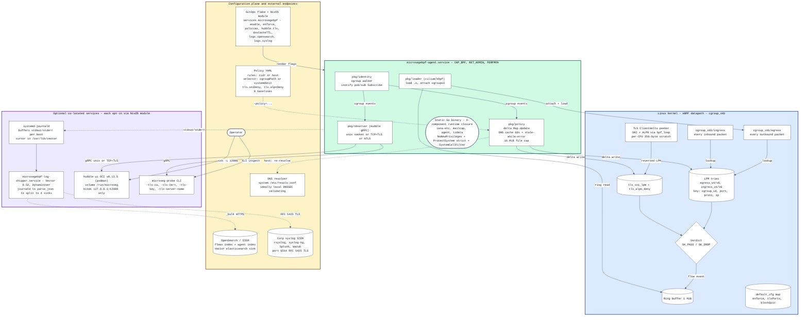
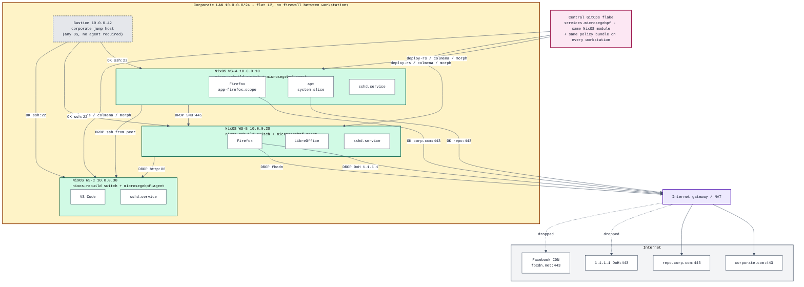

# nixos-microsegebpf

[English](README.md) · [Français](README.fr.md)

**eBPF-based microsegmentation for Linux workstations, with a
Hubble-compatible observability layer.**

`nixos-microsegebpf` brings Cilium's identity-aware policy model to a single
Linux machine. It attaches eBPF programs at the cgroupv2 root, looks up
each packet's local cgroup against a YAML policy, drops or forwards
accordingly, and emits flow events on a gRPC server that speaks the same
`cilium.observer.Observer` protocol as Hubble — so the upstream
[Hubble UI](https://github.com/cilium/hubble-ui) can render the
workstation's live flow map without a single Kubernetes resource in
sight.

## Architecture at a glance

The diagram below shows the four trust layers (kernel eBPF datapath,
agent userspace, optional co-located services, configuration plane +
external endpoints), how a packet flows from the cgroup_skb hook
through the LPM tries to a verdict, how flow events reach Hubble UI
and the SOC, and where every CVE-scored hardening surface lives.



> **Trust boundaries** — solid borders are processes / kernel
> primitives; rounded shapes are configuration documents; cylinders
> are stateful stores (eBPF maps, journald, OpenSearch). Solid
> arrows are in-process / kernel paths; dashed arrows cross the
> network or the on-disk configuration boundary. Every component on
> the optional row is **off by default** in the NixOS module.

---

## What problem this solves

### Local firewall filtering vs eBPF microsegmentation — the difference that matters

A traditional **local firewall** (`iptables`, `nftables`, the host
firewall built into the workstation) filters by **network identity**:
source IP, destination IP, port, protocol. Its mental model is a
network diagram with zones and rules between them: "allow
`10.0.0.0/24` to reach `10.0.0.5:443`". On a workstation this is
coarse — every process the user runs shares the same IP, so every
process inherits the same policy. A compromised browser tab and a
legitimate `apt update` look identical to the firewall. Worse, two
workstations on the same internal subnet are mutually reachable on
every port the local firewall doesn't explicitly close, which is the
classic precondition for lateral movement after a single host is
compromised.

**eBPF-based microsegmentation** filters by **workload identity**:
which process, which user, which systemd unit, which cgroup. The
mental model is a per-application policy: "Firefox may reach
`*.corporate.com:443`, nothing else may". The same destination behind
the same IP gets a different verdict depending on *who* is asking.
Two workstations on the same `/24` no longer trust each other by
default — each one's agent enforces its own least-privilege ingress
and egress at the kernel level, even when the network fabric below
would let them talk.

`nixos-microsegebpf` gives you the second model on a single Linux
box, with the natural workstation identities (cgroupv2 id, systemd
unit, uid) instead of the Kubernetes pod labels Cilium needs.

#### Lateral movement and per-app egress, illustrated

Three workstations on the same flat /24, a corporate jump host, and
an internet gateway. The traditional firewall would treat the LAN
as one big trust zone and let every workstation reach every other
on every port; the eBPF agent on each workstation turns the LAN
into a per-host policy zone, and the egress filter is per-cgroup.
`OK` = allowed by the rule set; `DROP` = dropped by the
`cgroup_skb` hook before the packet leaves the workstation (or
before it's delivered, on ingress).



What this shows:

  * **Every workstation is NixOS.** The same flake declares the
    `services.microsegebpf` module + the same policy bundle on
    WS-A, WS-B, WS-C; `nixos-rebuild switch` (or `deploy-rs` /
    `colmena` / `morph`) propagates a policy change to the whole
    fleet in one push. The bastion can be any OS and does not
    need the agent — it's only a *source* of allowed ingress
    traffic, not a peer to be policed.
  * **Lateral movement is contained.** WS-A trying to SMB-scan
    WS-B, or open an SSH session against WS-C, is dropped by
    WS-B and WS-C's own ingress hook respectively — even though
    nothing on the LAN fabric prevents the packet from arriving.
    The traditional firewall would let it through.
  * **SSH is whitelisted from the bastion only.** Each
    workstation's `sshd-restrict` baseline allows ingress on
    port 22 from `10.0.0.42/32` and drops everything else, so
    the corporate jump host still works for IR while a
    compromised peer cannot.
  * **Egress is per-application.** Firefox on WS-A is allowed
    to reach `corporate.com:443` (the corp web app) but is
    blocked from `1.1.1.1` (would bypass corp DNS) and from
    `*.fbcdn.net` (acceptable-use policy). `apt` running in
    `system.slice` is allowed to reach the corp repo on the
    same port, because the policy keys on the cgroup, not the
    IP. Two processes on the same workstation, going to the
    same gateway, get different verdicts.

### Centralised management via Nix, deployed at scale

The whole point of shipping this as a NixOS module + flake is so the
operator's workflow is the same as for any other piece of the
workstation configuration:

  1. The microseg policy bundle for every workstation in the fleet
     lives **in one git repo**, expressed in Nix. There is no
     per-host YAML to edit on the target.
  2. A change to the policy goes through **the same review and CI
     gates** as any other configuration change: `nix flake check`
     boots a NixOS VM, applies the new policy, asserts the
     in-kernel drop verdict before the change touches a real
     workstation.
  3. Roll-out happens through whatever NixOS deployment tool the
     fleet already uses (`nixos-rebuild switch`, `deploy-rs`,
     `colmena`, `morph`). systemd notices that the policy file path
     in `/nix/store` changed, restarts `microsegebpf-agent`, and
     the eBPF maps are repopulated in under a second on every host.
  4. Roll-back is `nixos-rebuild --rollback` — the previous
     generation of the policy is still in the store.

This matters in the **ANSSI workstation hardening context**, where
the rationale for microsegmentation on the *poste admin* is to deny
attackers the lateral movement they get for free on a flat internal
subnet. Without this, you have two unattractive options:

  * **Network-side microsegmentation** (private VLAN per host, NAC
    with per-MAC policy, internal firewall mesh) — operationally
    expensive, requires switch / router / appliance changes,
    typically out of reach of a small ops team.
  * **Per-host firewall rules edited individually** — no
    consistency, no review trail, and the moment one host drifts the
    fleet is back to "trust everything internal".

`nixos-microsegebpf` collapses the cost: the enforcement runs in the
kernel of every workstation (no new appliance to buy or operate), and
the management plane is a git repo in the same shape and tooling the
team already uses for the rest of the NixOS config. ANSSI-grade
lateral-movement containment becomes a configuration change, not an
infrastructure project.

### Concrete use cases

| Goal | How a policy looks | What it defends against |
|---|---|---|
| **Contain a compromised browser** | `selector: { systemdUnit: "app-firefox-*.scope" }` + drop egress to RFC1918 | A weaponised browser extension trying to scan or pivot to internal hosts |
| **Force corporate DNS** | `selector: { cgroupPath: /user.slice }` + drop TCP/UDP/53, /443, /853 to public resolvers | DNS-tunnel exfiltration, DoH/DoT bypass of the corporate filter |
| **Restrict SMTP to the MTA** | `selector: { cgroupPath: / }` + allow TCP/25 only to the relay CIDR | A malicious binary using a hard-coded SMTP server to exfiltrate |
| **Lock down sshd ingress** | `selector: { systemdUnit: sshd.service }` + allow inbound only from the bastion CIDR | Internet-exposed `sshd` getting credential-stuffed |
| **Block known C2 IPs** | `selector: { cgroupPath: / }` + drop egress to a threat-intel-fed IP list | Beaconing from a malicious binary already on disk |
| **Audit everything in Hubble** | `enforce = false` + observe-only | Mapping the actual flow surface of the workstation before writing any drop rule |

### How this differs from what you already have

| You already have... | What's missing for the use cases above | What microseg-poste adds |
|---|---|---|
| `nftables` / `iptables` | Per-process rules require the `cgroup` match extension and don't natively know systemd unit names | Per-systemd-unit rules out of the box; Hubble UI for visualisation |
| AppArmor / SELinux | No concept of *network destination* policy; they restrict syscall arguments and file access | Network-level enforcement at packet boundary |
| Tetragon | Enforcement is `SIGKILL` or syscall override → kills the process. Disruptive on a desktop (browser session lost) | `SK_DROP` at packet level → connection fails cleanly, app keeps running |
| Cilium | Requires Kubernetes; pod labels for identity | No cluster, no K8s; cgroup id + systemd unit as identity |
| OpenSnitch / Little Snitch | Interactive, per-connection prompts; great for personal use, not for ANSSI-style policy enforcement | Declarative YAML/Nix policy, GitOps-friendly, no user prompts |

### When NOT to use this

- **Server with high-bandwidth network throughput.** `cgroup_skb`
  costs a few hundred ns per packet; fine for a workstation, not for
  10 GbE+ servers — use Cilium proper there.
- **You want to filter by hostname** (`*.facebook.com`). This project
  works on resolved IPs and (soon) TLS SNI. For pure hostname-based
  filtering, pair with a DNS-policy tool.
- **You need L7 inspection** (block specific HTTP paths, parse JWTs,
  rate-limit by API endpoint). That's an L7 proxy job (Envoy,
  Traefik, NGINX). Microseg-poste deliberately stays at L3/L4.
- **You can't run a kernel ≥ 5.10.** The cgroup_skb attach point and
  the LPM_TRIE map type both predate that, but BTF / CO-RE
  reliability really starts at 5.10. Tested on 6.12.

---

## Why this exists

Cilium and Hubble are designed for Kubernetes clusters. Their identity
model is built around pod labels, their datapath attaches to pod veth
interfaces, and Hubble UI expects flows to come from a `hubble-relay`
fed by per-node `cilium-agent` instances. On a workstation there are no
pods, no API server, and no labels — so Cilium does not apply.

[Tetragon](https://github.com/cilium/tetragon), Isovalent's bare-metal
extraction of Cilium, is the closest fit: it loads eBPF on a host, ships
a TracingPolicy CRD, and runs without a cluster. But Tetragon
deliberately scopes itself to **runtime security observability +
syscall-level enforcement** (kprobe + `SIGKILL` / override return
value). It does not provide a network datapath: there is no
`bpf_lxc.c` / `bpf_host.c` equivalent in the Tetragon repo, no
LPM-based CIDR matching, no per-flow drop verdict at the packet level.

`nixos-microsegebpf` fills the gap. It does what Cilium does on a Kubernetes
node — load eBPF programs that own the packet path, evaluate identity-
aware policies, emit Hubble flows — but with the workstation's natural
identity primitives:

- the **cgroupv2 id** of the local endpoint (returned natively by
  `bpf_get_current_cgroup_id`)
- its **systemd unit name**, derived from the cgroup path
  (`/user.slice/user-1000.slice/app.slice/firefox.service` →
  `firefox.service`)
- its **owning user**, available via the same path traversal

This means a policy can target "anything launched by Firefox" or "every
process under `user.slice`" the same way a Cilium policy targets a pod
label.

## What it actually does

Once the agent is running, four things happen on every packet:

1. **eBPF hook fires.** `cgroup_skb/egress` (or `/ingress`) attached at
   the cgroupv2 root catches the packet just before it hits the wire
   (or just after it arrives). The handler reads the IP/L4 headers,
   asks the kernel which cgroup the local process belongs to, and
   builds a policy lookup key.

2. **LPM lookup.** The agent maintains four `BPF_MAP_TYPE_LPM_TRIE`
   maps — `egress_v4`, `ingress_v4`, `egress_v6`, `ingress_v6`. The
   key is a packed `(cgroup_id, peer_port, protocol, peer_ip)` tuple,
   with the LPM `prefix_len` set so that the cgroup/port/protocol
   match exactly and the IP is matched up to the configured CIDR
   prefix. A miss falls through to the configurable default verdict.

3. **Verdict applied.** The eBPF program returns `SK_DROP` (the kernel
   discards the packet, the syscall sees `EPERM`) or `SK_PASS` (forward
   normally). No userspace round-trip, no proxy.

4. **Flow event emitted.** Independently of the verdict, the program
   reserves a record on a 1 MiB ring buffer with the 5-tuple, the
   verdict, the matched policy id, and the local cgroup. The agent
   drains the ring buffer, decorates each record with the systemd
   unit name from a periodically-refreshed cache, converts it to a
   Cilium `flow.Flow` protobuf, and publishes it to every connected
   Hubble client.

## How a policy looks

```yaml
apiVersion: microseg.local/v1
kind: Policy
metadata:
  name: deny-public-dns-from-user-session
spec:
  selector:
    cgroupPath: /user.slice          # every cgroup under this prefix
  egress:
    - action: drop
      cidr: 1.1.1.0/24               # full CIDR, LPM-matched
      ports: ["53", "443", "853"]    # exact ports
      protocol: tcp
    - action: drop
      cidr: 2001:4860::/32           # IPv6 supported natively
      ports: ["443", "853"]
      protocol: tcp
    - action: drop
      cidr: 127.0.0.0/8
      ports: ["8000-8099"]           # ranges expanded server-side
      protocol: tcp
```

A policy reduces to "for each cgroup matching the selector, push N
entries into the LPM map for each direction." Selectors can target a
**systemd unit by glob** (`firefox.service`,
`app-firefox-*.scope`) or a **cgroup path prefix**
(`/user.slice/user-1000.slice`).

## TLS-aware SNI / ALPN matching (peek-only)

IP-based filtering hits a wall on CDNs: thousands of sites share the
same Cloudflare / Fastly / Akamai IPs, and an IP-only rule either
over-blocks (taking down legitimate destinations) or misses entirely
(if the destination's IP changes between policy write time and
runtime). microsegebpf augments the L3/L4 datapath with a peek-only
TLS parser that reads the cleartext SNI hostname and the first ALPN
protocol identifier from the TLS ClientHello, hashes them, and
applies a deny verdict that overrides an IP-level allow.

**No decryption.** SNI and ALPN travel in cleartext in the
ClientHello (the very first TLS handshake message). The eBPF parser
inspects those two extensions and nothing else; the rest of the
connection is opaque to it.

### Schema

```yaml
apiVersion: microseg.local/v1
kind: Policy
metadata:
  name: ban-doh-providers
spec:
  selector:
    cgroupPath: /                    # documentary; see "Limits" below
  tls:
    sniDeny:
      - "1.1.1.1"
      - "cloudflare-dns.com"
      - "dns.google"
    alpnDeny: []                     # see warning below
```

In Nix:

```nix
services.microsegebpf.policies = with microsegebpf.lib.policies.baselines; [
  (deny-sni { hostnames = [ "facebook.com" "tiktok.com" "x.com" ]; })
  (deny-alpn { protocols = [ "imap" "smtp" ]; })  # niche, see below
];
```

### Why this matters: the SNI vs IP demonstration

```
$ curl https://cloudflare.com                                  # IPv4 path A
exit=28   (DROP — SNI matched 'cloudflare.com')

$ curl --resolve cloudflare.com:443:1.1.1.1 https://cloudflare.com   # IPv4 path B
exit=28   (DROP — SNI still 'cloudflare.com', different peer IP)

$ curl https://example.com                                     # unrelated
exit=0    (ALLOW)
```

The same hostname behind a different IP, or behind a CDN we couldn't
have predicted, is still caught.

### Coverage matrix

What the SNI/ALPN parser does and does not see, broken out so you
don't get caught surprised:

| Protocol / context | Covered? | Why / why not |
|---|---|---|
| HTTP/1.1 over TLS, HTTP/2 over TLS, gRPC over TLS | ✅ | The TLS ClientHello is identical regardless of the L7 carried on top. |
| **HTTP/3 / QUIC** | ⚠ blanket-drop only | QUIC's TLS ClientHello is encrypted with keys derived from the destination Connection ID; deriving them in-kernel needs AES-128-CTR + AES-128-GCM which eBPF cannot run. Set `services.microsegebpf.blockQuic = true` (CLI flag `-block-quic`) to drop **all** UDP egress to your `tlsPorts`. Browsers fall back to TCP/TLS, where the SNI parser then matches. |
| **STARTTLS** (SMTP submission/587, IMAP/143, XMPP) | ❌ | The TLS handshake follows a plaintext exchange (`STARTTLS\n`) and arrives mid-stream. Our parser only inspects the first packet on a fresh TCP connection. |
| TLS on a non-standard port | ✅ via config | Set `services.microsegebpf.tlsPorts = [ 443 8443 4443 ];` (or `-tls-ports=443,8443,4443`). Up to 8 ports. The SNI parser fires on TCP egress to any of them. |
| **Wildcard SNI** (`*.example.com`) | ✅ | Implemented via an LPM trie on the reversed hostname (Cilium's FQDN approach). The pattern stores the bytes of `.example.com` reversed, with a trailing dot as terminator; the lookup reverses the on-wire SNI and the trie picks the longest matching prefix. Only single-level wildcards in the leftmost label are supported (`*.foo.com`, not `evil*.foo.com` or `foo.*.com`). |
| **L3/L4 by FQDN hostname** (`host: api.corp.example.com`) | ✅ | Use `host:` instead of `cidr:` in any egress/ingress rule. The agent resolves the FQDN to A and AAAA records via the system resolver and installs one `/32` (v4) or `/128` (v6) entry per resolved address. Re-resolution happens on every Apply (cgroup-event-driven or fallback ticker), so the rule follows the FQDN as its DNS records change. Resolution failures log a warning and skip the rule for that round. |

### Limits

- **TLS 1.3 ECH (Encrypted Client Hello)** is the long-term threat.
  When a destination negotiates ECH (Cloudflare and Firefox have
  rolled this out progressively since 2024), the SNI is encrypted
  and the parser silently fails open. Plan for a 2-3 year horizon
  before this becomes the default.
- **Fragmented ClientHello.** The parser inspects the linear part
  of the first TCP segment carrying the ClientHello. In practice
  every common client fits the SNI/ALPN extensions in the first
  segment (~512 bytes typical, well within MTU). Pathological
  clients sending 16 KiB of pre-shared-key extensions could split
  across segments — those slip through.
- **Per-cgroup scoping.** PoC keys the TLS map only on the FNV-64
  hash of the hostname / ALPN string. SNI denies are therefore
  global to the host: every cgroup is subject to them, regardless
  of the surrounding policy doc's selector. The selector field at
  the policy level is documentary in this case. Per-cgroup TLS
  rules require a `(cgroup_id, hash)` key — reasonable follow-up.
- **First ALPN entry only.** The walker inspects only the first
  protocol in the ALPN list. Sufficient to catch single-purpose
  beacons (`h2`-only); a malicious client sending
  `["h2", "x-evil"]` with `x-evil` second slips past.
- **Blanket-blocking ALPN `h2` is a footgun.** Almost every modern
  HTTPS client advertises `h2`. Use `alpnDeny` for narrow protocol
  bans (`imap`, `smtp`, custom identifiers) or in air-gapped
  deployments where the protocol whitelist is short.

## Recipes

Eight worked examples covering the most common workstation-hardening
shapes. The first six are `services.microsegebpf.policies` fragments
you can drop into your deployment flake; the last two (centralised
log shipping to OpenSearch and syslog) configure the operational
plumbing around the agent.

### Recipe 1 — Force the corporate DNS resolver

**Use case.** You run a corporate DNS resolver (with logging,
malware blocklists, internal-zone records). You don't want a user's
browser, package manager, or compromised binary to bypass it by
talking to Cloudflare's `1.1.1.1` directly, or worse, tunnelling
through DoH (`https://1.1.1.1/dns-query`) or DoT
(`tcp/853 to 8.8.8.8`).

**Why this matters.** A direct path to a public resolver bypasses
all the corporate filtering, logging, and detection — both for
day-to-day policy violations and for malware C2 over DNS.

```nix
services.microsegebpf.policies = with microsegebpf.lib.policies; [
  # Drop classic DNS, DoT, DoH to the well-known public resolvers.
  # The baseline ships a curated IP+port list for Cloudflare, Google,
  # Quad9, OpenDNS, AdGuard.
  (baselines.deny-public-dns { })

  # Belt-and-suspenders: also block via SNI any host pretending to
  # be a DoH provider on a different IP (CDN re-routing, new IPs
  # not yet in the IP feed). The wildcard catches cdn-hosted
  # variants like resolver-dot1.dnscrypt.example.com.
  (mkPolicy {
    name = "deny-doh-providers-by-sni";
    selector = { cgroupPath = "/"; };
    sniDeny = [
      "cloudflare-dns.com"
      "*.cloudflare-dns.com"
      "dns.google"
      "*.dns.google"
      "dns.quad9.net"
      "*.quad9.net"
      "doh.opendns.com"
      "*.dnscrypt.org"
    ];
  })
];
```

**How it works.**

  - `baselines.deny-public-dns {}` blocks **TCP and UDP** to the IPs
    of the major public resolvers on ports `53`, `443`, and `853`
    (covers plain DNS, DoH, DoT). It's keyed at the `/user.slice`
    selector by default; pass `cgroupPath = "/"` to extend to
    system services too.
  - The custom `mkPolicy` adds a **TLS SNI deny list** so that even
    if a destination's IP isn't in our list, a TLS handshake
    advertising the SNI of a known DoH provider gets dropped before
    the ClientHello finishes.
  - The wildcard entries (`*.cloudflare-dns.com`) catch CDN-edge
    variants without enumerating every PoP.

**Variations.**

  - To allow DoH only to **your** corporate resolver, append it to
    `extraIPv4` and `extraIPv6` of `deny-public-dns` to keep the
    baseline blocklist while exempting your IP via an explicit
    `allow` entry from `mkPolicy`.

### Recipe 2 — Browser containment: no internal-network reach

**Use case.** Firefox / Chromium runs untrusted JavaScript every
day. A weaponised extension or a 0-day RCE shouldn't be able to scan
the corporate `10.0.0.0/8`, hit the internal Confluence on port 80,
or mount lateral SMB attacks.

**Why this matters.** This is the single highest-impact ANSSI
workstation hardening: it converts "compromised browser" from "the
attacker now sees the internal network" into "the attacker has a
sandboxed browser process and no usable network handle to the LAN".

```nix
services.microsegebpf.policies = with microsegebpf.lib.policies; [
  # The baseline blocks egress from /user.slice to RFC1918 on the
  # commonly-attacked ports (SSH, HTTP, HTTPS, SMB, RDP, alt-HTTP).
  (baselines.deny-rfc1918-from-user-session { })

  # Carve out a per-unit allow for IT helpdesk SSH (the user
  # legitimately needs to ssh to the bastion).
  (mkPolicy {
    name = "allow-bastion-ssh-from-user";
    selector = { cgroupPath = "/user.slice"; };
    egress = [
      (allow {
        cidr = "10.0.0.42/32";   # bastion IP
        ports = [ "22" ];
        protocol = "tcp";
      })
    ];
  })
];
```

**How it works.**

  - The baseline drops six common ports across all three RFC1918
    ranges. Browser tabs, mail clients, anything else under
    `/user.slice` cannot reach internal services on those ports.
  - The carve-out is a higher-priority `allow` that re-enables the
    one legitimate path. **Rule precedence**: the LPM trie picks
    the longest prefix match per `(cgroup, port, proto)` tuple, so
    the `/32` entry wins over the `/8` drop for `10.0.0.42:22`.
  - Browser network IO to the public internet (`0.0.0.0/0` minus
    RFC1918) is unaffected — no implicit egress firewall is
    introduced.

**Variations.**

  - To extend to all sub-cgroups of a specific systemd unit:
    `selector = { systemdUnit = "app-firefox-*.scope"; }`.
  - For Chromium without per-tab process isolation in scope, switch
    `cgroupPath = "/user.slice"` to a tighter selector against
    Chromium's specific scope name.

### Recipe 3 — Lock SSH to the bastion only

**Use case.** Production workstations expose `sshd` for incident
response, but only the corporate bastion at `10.0.0.42` should ever
reach it. Internet-exposed `sshd` is a magnet for credential
stuffing and the workstation should refuse SSH from any other
source even if a misconfigured firewall accidentally lets the
packets in.

```nix
services.microsegebpf.policies = with microsegebpf.lib.policies; [
  (baselines.sshd-restrict { allowFrom = "10.0.0.42/32"; })
];
```

**How it works.**

  - `selector = { systemdUnit = "sshd.service"; }` (set inside the
    baseline) targets the cgroup that systemd creates for `sshd`.
  - The baseline emits a single `ingress` rule:
    `allow { cidr = allowFrom; ports = [ "22" ]; protocol = "tcp"; }`.
    With no `drop` rule listed and `defaultIngress = "drop"` set on
    the policy module, every other source is rejected by default.
  - **You must set `services.microsegebpf.defaultIngress = "drop"`
    at the module level** for this to bite — otherwise the missing
    match falls through to the default-allow.

**Variations.**

  - For multiple bastion IPs: pass a `/24` (`"10.0.0.0/24"`) or stack
    multiple `mkPolicy` calls each adding one IP.
  - For an HA bastion pair on different ports, drop the baseline
    and use `mkPolicy` directly with two `ingress` rules.

### Recipe 4 — SMTP outbound only via the corporate relay

**Use case.** A compromised binary trying to exfiltrate via direct
SMTP to a hard-coded mail server should fail. The legitimate path
is through the corporate MTA (typically `smtp-relay.corp:25`).

```nix
services.microsegebpf.policies = with microsegebpf.lib.policies; [
  (baselines.smtp-relay-only { relayCIDR = "10.0.1.10/32"; port = "25"; })
];
```

**How it works.**

  - `selector = { cgroupPath = "/"; }` — applies to every cgroup on
    the host (system services and user processes alike).
  - Two rules in order of precedence (LPM, longest match wins):
    1. `allow` to `10.0.1.10/32` on port 25 (`/32` = 32 bits prefix)
    2. `drop`  to `0.0.0.0/0` on port 25 (`/0` = 0 bits prefix)
  - The relay's `/32` always beats the catch-all `/0`, so legitimate
    mail flows; everything else on port 25 is rejected.

**Variations.**

  - For SMTPS on port 465 or submission on 587, pass `port = "465"`
    or `port = "587"` and stack two policies.
  - To exempt a specific systemd unit (e.g. `postfix.service`)
    from the drop, add a `mkPolicy` with
    `selector = { systemdUnit = "postfix.service"; }` and an
    explicit `allow` to `0.0.0.0/0:25` — its `/32`-style cgroup
    match takes precedence.

### Recipe 5 — Block social media via SNI wildcards

**Use case.** Compliance / acceptable-use policy bans
work-time access to TikTok, Facebook, Instagram. IP-based blocking
is futile (CDN-hosted, IPs rotate constantly), but SNI matching
catches every CDN edge that serves the brand.

```nix
services.microsegebpf.policies = with microsegebpf.lib.policies; [
  (mkPolicy {
    name = "deny-social-media-sni";
    selector = { cgroupPath = "/user.slice"; };
    sniDeny = [
      "facebook.com"
      "*.facebook.com"
      "fbcdn.net"
      "*.fbcdn.net"
      "instagram.com"
      "*.instagram.com"
      "tiktok.com"
      "*.tiktok.com"
      "*.tiktokcdn.com"
      "x.com"
      "*.x.com"
      "twitter.com"      # legacy redirect
      "*.twitter.com"
    ];
  })

  # Force QUIC fallback so the SNI matcher actually fires. Without
  # this knob, browsers happily fetch tiktok.com over HTTP/3 (UDP)
  # and our TCP-only parser never sees the SNI.
];

services.microsegebpf.blockQuic = true;
```

**How it works.**

  - `*.facebook.com` matches every subdomain (`m.facebook.com`,
    `web.facebook.com`, `static.xx.fbcdn.net`, ...). Pair it with
    the bare `facebook.com` to also catch the apex.
  - Multiple sites in one policy is just a longer list — the LPM
    trie scales to thousands of entries with O(string-length)
    lookup.
  - `services.microsegebpf.blockQuic = true` is **essential** here.
    HTTP/3's TLS ClientHello is encrypted; we can't peek SNI on
    UDP/443. Forcing QUIC to fail makes browsers retry on TCP/443
    where the SNI parser does its job.

**Variations.**

  - For an allow-list approach (only let users reach
    `*.corporate.com`), invert: set
    `defaultEgress = "drop"` and write `mkPolicy` with `egress`
    `allow` rules for the destinations you want to permit. SNI
    matching by itself is a *deny-only* feature (no allow override
    on the SNI side; the IP-level verdict is the source of truth).

### Recipe 6 — Combine TLS port hardening + threat-feed integration

**Use case.** You consume a daily threat-intel feed (a list of
known-bad IPs serving C2 over HTTPS or unusual TLS ports) and want
microsegebpf to enforce it without re-inventing the deployment
pipeline.

```nix
let
  # Pulled at deploy time by the CI step that builds the workstation
  # closure. IO must happen at *build* time (Nix is hermetic at
  # eval), so a separate fetcher derivation feeds the list in.
  threatFeed = builtins.fromJSON (builtins.readFile ./threat-ips.json);
in
{
  services.microsegebpf = {
    enable = true;
    enforce = true;

    # Treat 443, 8443, and a custom corporate VPN port as TLS-bearing.
    # The SNI parser fires on TCP egress to any of these.
    tlsPorts = [ 443 8443 4443 ];

    # Drop QUIC blanket so SNI-based enforcement isn't bypassed
    # via HTTP/3.
    blockQuic = true;

    policies = with microsegebpf.lib.policies; [
      # Drop egress to every IP in the feed, on the same TLS-bearing
      # ports. The IP feed is the precise blocker; the SNI check
      # below catches re-hosted infrastructure.
      (baselines.deny-threat-feed {
        ips = map (ip: "${ip}/32") threatFeed.ips;
        ports = [ "443" "8443" "4443" ];
      })

      # Domain-side feed (different vendor, different threat surface).
      (mkPolicy {
        name = "deny-threat-feed-sni";
        selector = { cgroupPath = "/"; };
        sniDeny = threatFeed.domains;   # plain + wildcard mix
      })
    ];

    hubble.ui.enable = true;   # see what gets dropped, in real time
  };
}
```

**How it works.**

  - `tlsPorts = [ 443 8443 4443 ]` extends the SNI parser to fire on
    a non-standard port the corporate VPN happens to use. Both
    SNI matching and `blockQuic` honour this list.
  - The threat-feed IPs go into the standard L3/L4 LPM (covered by
    `deny-threat-feed`); their hostnames go into the SNI LPM
    (covered by the custom `mkPolicy`). Either layer alone catches
    most beacons; together they cover IP rotation and domain
    rotation respectively.
  - `enforce = true` flips drops on. Combine with
    `emitAllowEvents = false` (the production setting) to keep
    Hubble noise low.

**Variations.**

  - For a feed updated more often than every NixOS rebuild, fetch
    it via systemd timer into `/etc/microsegebpf/threat.yaml` and
    set `services.microsegebpf.policies = [ (builtins.readFile
    "/etc/microsegebpf/threat.yaml") ]`. The agent's inotify
    watcher picks up changes within ~250 ms.
  - Build a minimal nix derivation that fetches the feed at build
    time (using `pkgs.fetchurl` with a hash) so the closure is
    fully reproducible — the trade-off is a rebuild per feed
    update.

### Recipe 7 — Centralised log shipping to OpenSearch

**Use case.** A workstation that drops a malicious flow at 03:14
local time should not require an analyst to SSH in and grep
journald to find out. Ship every flow event and every control-
plane log into a fleet-wide OpenSearch cluster — same place the
SOC already looks — and the next morning's investigation is a
Kibana / OpenSearch Dashboards query, not a forensic field trip.

**Why this matters.** Local journald is fine for one host but
collapses at fleet scale: no cross-host correlation, no
retention beyond the host's disk budget, no alerting hook. The
Hubble UI is great for interactive flow exploration but is
ephemeral and host-local too. A central log store solves all
three: cross-host search, weeks-to-months retention, and
alerting that fires off a Sigma / Wazuh / OSSEC rule when the
same C2 SNI gets dropped on three different hosts within five
minutes.

```nix
services.microsegebpf = {
  enable = true;
  # ... your usual policy + observability bits ...

  logs.opensearch = {
    enable = true;

    # Any node of the cluster; Vector handles the bulk endpoint
    # routing internally.
    endpoint = "https://opensearch.corp.local:9200";

    # Daily indices — the OpenSearch idiom for time-series data.
    # Strftime tokens are expanded by Vector at write time.
    indexFlows = "microseg-flows-%Y.%m.%d";
    indexAgent = "microseg-agent-%Y.%m.%d";

    # Basic auth (mandatory in production). The password is read
    # by systemd from the file at start time and passed to Vector
    # via LoadCredential — never on the command line, never in
    # the unit's environment as plaintext.
    auth.user = "microseg-shipper";
    auth.passwordFile = "/run/keys/opensearch-microseg.pwd";

    # TLS pinning to the corporate CA. Set verifyCertificate=false
    # only in a lab — the warning in the journald sink is loud
    # for a reason.
    tls.caFile = "/etc/ssl/certs/corp-internal-ca.pem";
  };
};
```

**How it works.**

  - The agent **does not speak OpenSearch directly.** It writes
    structured JSON to stdout (one line per flow event) and
    stderr (slog control-plane records). systemd captures both
    into journald with `_SYSTEMD_UNIT=microsegebpf-agent.service`.
  - The module enables a second systemd unit
    (`microsegebpf-log-shipper.service`) running
    [Vector](https://vector.dev) under `DynamicUser=true`. The
    Vector config is generated by Nix as a JSON file in the
    store, so it's reproducible and reviewable as part of the
    NixOS closure diff.
  - The Vector pipeline is four nodes:
    1. `sources.microseg_journal` — `journald` source filtered to
       only the agent's unit (`include_units` = `[ "microsegebpf-
       agent.service" ]`), `current_boot_only = true`.
    2. `transforms.microseg_parse` — VRL `remap` that decodes
       `.message` as JSON and merges the parsed fields into the
       event root. Non-JSON lines pass through unchanged.
    3. `transforms.microseg_filter_{flows,agent}` — two `filter`
       transforms splitting on `exists(.verdict)` so flow events
       and slog records land in separate indices.
    4. `sinks.opensearch_{flows,agent}` — two `elasticsearch`
       sinks (the Elasticsearch wire protocol is the same as
       OpenSearch) writing to the configured indices with bulk
       mode.
  - The shipper unit is sandboxed: `DynamicUser=true`,
    `ProtectSystem=strict`, `RestrictAddressFamilies` limited to
    `AF_INET/AF_INET6/AF_UNIX`, syscall filter `@system-service`
    + `@network-io`. It only needs network egress to OpenSearch
    and read access to journald (granted via
    `SupplementaryGroups = [ "systemd-journal" ]`).
  - **Decoupling matters.** If the OpenSearch cluster is down,
    Vector retries with exponential backoff — the agent and its
    eBPF datapath keep running. If the shipper unit crashes,
    journald keeps buffering and Vector picks up where the
    cursor left off when it restarts. There is no path where a
    log-pipeline outage takes down the enforcement.

**Variations.**

  - **Adding fields at the source** (e.g. tag every event with
    the workstation's hostname and ANSSI zone) — use
    `extraSettings` to splice in another `remap` between
    `microseg_parse` and the filters:
    ```nix
    services.microsegebpf.logs.opensearch.extraSettings = {
      transforms.add_zone = {
        type = "remap";
        inputs = [ "microseg_parse" ];
        source = ''
          .anssi_zone = "poste-admin"
          .hostname = get_hostname!()
        '';
      };
      transforms.microseg_filter_flows.inputs = [ "add_zone" ];
      transforms.microseg_filter_agent.inputs = [ "add_zone" ];
    };
    ```
  - **Different cluster per stream** (cold archive vs hot SOC) —
    override one of the sinks via `extraSettings` to point at a
    second endpoint with a different auth.
  - **Disk-backed buffering** for unreliable WAN links — set
    `extraSettings.sinks.opensearch_flows.buffer = { type =
    "disk"; max_size = 268435456; }` (256 MiB cap). The
    `data_dir = /var/lib/vector` is already wired (with
    `StateDirectory = "vector"` so `DynamicUser` still works).
  - **Keep one OpenSearch index per workstation** by templating
    the index name with the host: `indexFlows = "microseg-flows-
    \${HOSTNAME}-%Y.%m.%d";` (Vector expands env vars in the
    index template; systemd already injects HOSTNAME into the
    unit's environment).

### Recipe 8 — Centralised syslog forwarding (RFC 5424 over TLS)

**Use case.** Your SOC has a SIEM (Splunk, Wazuh, ELK, IBM QRadar,
Microsoft Sentinel, …) that ingests via syslog. You want every
flow event and every agent control-plane log to land there with
the correct facility code so the SIEM's existing parsing and
alerting pipelines fire on day one.

**Why this matters.** OpenSearch is great for ad-hoc search but
your SOC's incident workflow probably runs through the SIEM:
correlation rules, ticketing integration, MITRE ATT&CK mapping,
on-call paging. A SIEM that already knows what to do with
`local4.warning` from a NixOS workstation is faster to onboard
than a brand-new OpenSearch cluster nobody is on-call for.

**Why TLS.** Flow events name the workstations dropping traffic
to specific destinations on specific ports — exactly the
inventory an attacker who's already inside wants. Plain UDP/514
syslog leaks all of that to anyone passive on the path. RFC 5425
syslog-over-TLS (port 6514) is the modern default; the module
defaults `mode = "tcp+tls"` and emits a deployment-time warning
if you downgrade to UDP or plain TCP.

```nix
services.microsegebpf = {
  enable = true;
  # ... your usual policy + observability bits ...

  logs.syslog = {
    enable = true;

    # SIEM collector. Port 6514 is the IANA assignment for
    # syslog-over-TLS (RFC 5425). Vector connects directly —
    # no rsyslog or syslog-ng relay in between.
    endpoint = "siem.corp.local:6514";

    # Default; spell it out so the intent is reviewable.
    mode = "tcp+tls";

    # APP-NAME field of the RFC 5424 header. SIEMs route on
    # this — keep it short (<= 48 ASCII chars) and stable.
    appName = "microsegebpf";

    # Facilities. `local4` is a common SIEM convention for
    # security-relevant network logs; `daemon` is the
    # canonical service control-plane bucket.
    facilityFlows = "local4";
    facilityAgent = "daemon";

    # Pin the SIEM's CA. For mTLS, also set certFile + keyFile;
    # the key is loaded via systemd LoadCredential so it can
    # live on a path the dynamic user can't read directly
    # (e.g. /etc/ssl/private mode 0640 root:ssl-cert).
    tls = {
      caFile  = "/etc/ssl/certs/corp-internal-ca.pem";
      certFile = "/etc/ssl/certs/microseg-client.pem";   # mTLS, optional
      keyFile  = "/etc/ssl/private/microseg-client.key"; # mTLS, optional
      # keyPassFile = "/run/keys/microseg-key-pass";     # if encrypted
      verifyCertificate = true;
      verifyHostname    = true;
    };
  };
};
```

**How it works.**

  - The module wires a Vector pipeline alongside (or instead of)
    the OpenSearch one — same `microsegebpf-log-shipper.service`,
    same journald source, same parse + filter transforms. Two
    extra `remap` transforms format each stream as RFC 5424:
    ```
    <PRI>1 TIMESTAMP HOSTNAME APP-NAME - - - JSON-BODY
    ```
    `PRI = facility * 8 + severity`. Severity is computed per
    event from the slog `.level` (agent stream) or `.verdict`
    (flow stream): drop → 4 (warning), log → 5 (notice), allow →
    6 (info); ERROR → 3, WARN → 4, INFO → 6, DEBUG → 7.
  - Two `socket` sinks write to the configured endpoint over
    TCP+TLS with newline-delimited framing (compatible with
    rsyslog `imtcp`, syslog-ng `network()`, Splunk HEC syslog,
    Wazuh's port 6514 listener).
  - On the wire, three example events look like:
    ```
    <164>1 2026-04-20T07:53:10.457337Z host microsegebpf - - - {"verdict":"drop","src":"10.0.0.1:443","dst":"1.1.1.1:443","unit":"firefox.service",...}
    <165>1 2026-04-20T07:53:10.457355Z host microsegebpf - - - {"verdict":"log","src":"10.0.0.1:53","dst":"9.9.9.9:53","unit":"dnsmasq.service",...}
    <166>1 2026-04-20T07:53:10.457362Z host microsegebpf - - - {"verdict":"allow","src":"10.0.0.1:80","dst":"8.8.8.8:80","unit":"sshd.service",...}
    ```
    164 = local4(20) * 8 + warning(4); 165 = local4 + notice;
    166 = local4 + info. SIEMs that route on PRI alone will
    funnel drops to a higher-attention bucket without any
    custom parsing.
  - **Decoupling is the same as the OpenSearch shipper.** TLS
    handshake fails or SIEM is down → Vector retries with
    backoff, agent and eBPF datapath keep enforcing. journald
    keeps buffering until the cursor (in `/var/lib/vector/`)
    catches up.

**Variations.**

  - **Both OpenSearch and syslog at once** (typical SIEM
    deployment): enable both option blocks. They share the
    single `microsegebpf-log-shipper.service` Vector instance —
    one process, four sinks (two ES bulk + two syslog socket).
  - **mTLS** (the SIEM authenticates the workstation): set
    `tls.certFile`, `tls.keyFile` (and `tls.keyPassFile` if
    the key is encrypted). The private key is bind-mounted
    into the unit via systemd `LoadCredential` from whatever
    secret-management path you use (SOPS, agenix, vault-agent
    template).
  - **Different SIEMs per stream** (one for verdicts, one for
    audit logs at a different vendor): use `extraSettings` to
    override `sinks.syslog_flows.address` while keeping the
    default `sinks.syslog_agent` pointed at `endpoint`.
  - **Strict RFC 5425 octet-counting framing** (some IBM /
    legacy enterprise collectors require it): set `framing =
    "bytes"` and add a VRL transform via `extraSettings` that
    prepends the ASCII-decimal length + space to each
    `.message`. Most modern collectors (rsyslog, syslog-ng,
    Splunk, Wazuh) accept the default `newline_delimited` so
    you'll rarely need this.
  - **Legacy plain TCP / UDP** (lab, on-prem trusted segment,
    or transitional period): set `mode = "tcp"` or `mode =
    "udp"`. The module emits a NixOS warning at evaluation time
    so the choice is explicit and reviewable in the rebuild
    log.

## The Hubble integration

Hubble UI is a React app that connects to a gRPC endpoint speaking
[`observer.proto`](https://github.com/cilium/cilium/blob/main/api/v1/observer/observer.proto).
It calls four RPCs at startup:

| RPC | What nixos-microsegebpf returns |
|---|---|
| `ServerStatus` | Number of buffered flows, "1 connected node" (this host), uptime |
| `GetNodes` | One `Node` entry with the local hostname and `NODE_CONNECTED` |
| `GetFlows(stream)` | A replay of the recent flow ring, then live tail forever |
| `GetNamespaces` | Empty (we don't model K8s namespaces) |

Each flow is a real `flow.Flow` protobuf with:

- **IP**: source, destination, IPv4 or IPv6 family
- **Layer4**: TCP or UDP source/destination port
- **Source / Destination Endpoint**: when the local side is the source
  (egress), `Source` carries `cluster_name=host`, the systemd unit as
  `pod_name`, and labels like `microseg.unit=firefox.service`,
  `microseg.cgroup_id=12345`. The remote side becomes a `world`
  endpoint. On ingress the roles swap.
- **Verdict**: `FORWARDED`, `DROPPED` (with `DropReason=POLICY_DENIED`),
  or `AUDIT`
- **TrafficDirection**: `INGRESS` or `EGRESS`

The result: the unmodified upstream Hubble UI renders our workstation's
flow map exactly as if the local cgroups were Cilium pods. Service map,
flow log, drop visualisation — all work out of the box.

A small companion CLI, `microseg-probe`, calls the same RPCs from the
command line for headless inspection:

```
$ microseg-probe -limit=10
=== ServerStatus ===
  Version:        nixos-microsegebpf/0.1 (hubble-compat)
  NumFlows:       40 / 4096
  ConnectedNodes: 1
=== GetFlows (limit=10) ===
  DROPPED    EGRESS  10.0.2.15:52606 -> 1.1.1.1:443  src=host/session-50.scope dst=world/ policy=1
  FORWARDED  EGRESS  10.0.2.15:22 -> 10.0.2.2:47861  src=host/sshd.service dst=world/ policy=0
  ...
```

### Securing the gRPC observer with TLS / mTLS

The default listener (`unix:/run/microseg/hubble.sock`, mode 0750
via `RuntimeDirectoryMode`) is restricted to root by the kernel —
no transport authentication needed. **A TCP listener is a different
story:** every flow event the agent observes (5-tuples + SNI) gets
streamed to anyone who can connect. If you need to consume flows
from outside the workstation, wire TLS — and for production, mTLS.

```nix
services.microsegebpf.hubble = {
  listen = "0.0.0.0:50051";        # or 127.0.0.1:50051 + SSH tunnel

  tls = {
    certFile          = "/etc/ssl/certs/microseg-server.pem";
    keyFile           = "/etc/ssl/private/microseg-server.key";
    clientCAFile      = "/etc/ssl/certs/microseg-clients-ca.pem";  # mTLS
    requireClientCert = true;                                       # mTLS hard-on
  };
};
```

Without `certFile` + `keyFile` set, the module emits an
evaluation-time warning naming the cleartext exposure (and the
agent emits a runtime WARN slog line at startup, mirroring the
Nix-time message). The `microseg-probe` CLI mirrors the same TLS
options (`-tls-ca`, `-tls-cert`, `-tls-key`, `-tls-server-name`,
`-tls-insecure`) so an operator can verify end-to-end:

```sh
microseg-probe -addr=corp-host:50051 \
  -tls-ca=/etc/ssl/certs/corp-ca.pem \
  -tls-cert=/etc/ssl/certs/operator.pem \
  -tls-key=/etc/ssl/private/operator.key \
  -tls-server-name=corp-host \
  -limit=10 -follow
```

### FQDN resolution caching

`host:` rules re-resolve the DNS name on every Apply tick. To cap
the resolver-poisoning attack window — a malicious DNS response
flips the `/32` LPM entry between Apply ticks — the agent caches
results for `services.microsegebpf.dnsCacheTTL` (default `60s`).
A failed re-resolution falls back to the last known-good answer
so a transient resolver outage doesn't drop a previously-validated
FQDN rule. See [SECURITY-AUDIT.md §F-3](SECURITY-AUDIT.md) for the
threat model.

## Build

### Development workflow

```sh
cd nixos-microsegebpf
nix-shell --run 'make build'
sudo ./bin/microseg-agent -policy=examples/policy.yaml
```

The `nix-shell` brings Go 1.25, clang 21, llvm 21, bpftool 7, libbpf,
protoc, rsync. `make build` runs `bpftool` to dump the running
kernel's BTF into `bpf/vmlinux.h`, calls `bpf2go` to compile
`bpf/microseg.c` and emit Go bindings, then `go build` produces the
`bin/microseg-agent` static binary.

### Reproducible Nix build

```sh
nix-build
sudo ./result/bin/microseg-agent -policy=examples/policy.yaml
```

`vendorHash` is pinned in `nix/package.nix`; recompute when `go.mod`
changes:

```sh
nix-build 2>&1 | grep "got:" | awk '{print $2}'
# paste into nix/package.nix
```

The Nix build expects pre-generated `bpf/microseg_bpfel.{go,o}` and
`bpf/vmlinux.h` (run `make generate` once, outside the Nix sandbox,
before `nix-build`). This is because the sandbox has no access to
`/sys/kernel/btf/vmlinux`, and shipping a vendored vmlinux.h for every
target kernel is impractical.

## NixOS module + flake (recommended GitOps workflow)

The repo ships a `flake.nix` that exposes `nixosModules.default`,
`packages.default`, a composable `lib.policies` library, and a
`checks.vm-test` that boots a NixOS VM and asserts the datapath
actually drops the matched flow. The intended consumption pattern is
a deployment flake in your existing infra repo:

```nix
{
  inputs = {
    nixpkgs.url      = "github:NixOS/nixpkgs/nixos-25.11";
    microsegebpf.url = "github:aambert/nixos-microsegebpf";
  };

  outputs = { self, nixpkgs, microsegebpf, ... }: {
    nixosConfigurations.workstation = nixpkgs.lib.nixosSystem {
      system = "x86_64-linux";
      modules = [
        microsegebpf.nixosModules.default
        ({ ... }: {
          services.microsegebpf = {
            enable = true;
            policies = with microsegebpf.lib.policies.baselines; [
              (deny-public-dns {})
              (sshd-restrict { allowFrom = "10.0.0.0/24"; })
              (deny-rfc1918-from-user-session {})
            ];
            hubble.ui.enable = true;
          };
        })
      ];
    };

    # Re-export the upstream VM test so `nix flake check` in your
    # infra repo gates deployments on the same end-to-end assertion.
    checks = microsegebpf.checks;
  };
}
```

### GitOps workflow

1. Edit a policy in your infra repo as a Nix expression (composable,
   not raw YAML).
2. Push to git. CI runs `nix flake check`. The composed
   `checks.vm-test` boots a NixOS VM, applies the new policy, and
   asserts the in-kernel drop verdict — bad policies fail CI before
   any host sees them.
3. CI deploys via your existing `nixos-rebuild switch --flake .`,
   `deploy-rs`, `colmena`, or `morph` step.
4. systemd notices the new `ExecStart` hash (the policy file path in
   `/nix/store` changes), restarts `microsegebpf-agent`, and the
   eBPF maps are repopulated in <1 second.
5. Roll back any time with `nixos-rebuild --rollback`. The previous
   policy generation is still in the store.

A complete deployment flake lives in
[`examples/deployment/flake.nix`](examples/deployment/flake.nix).

### Available policy baselines

`microsegebpf.lib.policies.baselines` ships these out of the box:

| Function | Effect |
|---|---|
| `deny-public-dns { cgroupPath, extraIPv4, extraIPv6 }` | Drops direct connections to Cloudflare, Google, Quad9, OpenDNS, AdGuard on TCP+UDP/53, /443, /853 from the chosen cgroup tree. Forces resolution through the corporate resolver. |
| `sshd-restrict { allowFrom, port }` | Restricts `sshd.service` ingress to a single CIDR. |
| `deny-rfc1918-from-user-session { cgroupPath, ports }` | Blocks lateral movement to RFC1918 from the user session. |
| `smtp-relay-only { relayCIDR, port }` | Egress on TCP/25 only to the named relay; everything else dropped. |
| `deny-threat-feed { ips, cgroupPath, ports }` | Blocks an explicit list of C2/sinkhole IPs. Caller supplies the list, typically generated from a threat-intel feed at deploy time. |
| `deny-host { hostnames, ports, protocol, cgroupPath }` | L3/L4 deny by FQDN. The agent resolves each hostname on every Apply and installs one /32 (v4) or /128 (v6) entry per A/AAAA record. Follows the destination as its DNS records rotate — handy for CDN-fronted services where a static CIDR goes stale. |
| `deny-sni { hostnames }` | TLS peek deny by SNI. Accepts exact patterns (`facebook.com`) and single-label wildcards (`*.facebook.com`). Backed by an LPM trie on the reversed hostname, see ARCHITECTURE.md §9.2. |
| `deny-alpn { protocols }` | TLS peek deny by ALPN identifier (`h2`, `http/1.1`, `imap`, `smtp`, ...). Use sparingly: blanket-blocking `h2` knocks out almost every modern HTTPS client. |

For one-off rules, use `microsegebpf.lib.policies.mkPolicy`,
`drop`, and `allow` directly — see
[`nix/policies/default.nix`](nix/policies/default.nix). `mkPolicy`
also accepts inline `sniDeny` / `alpnDeny` lists for ad-hoc TLS
matching without going through the baselines.

### Direct module import (no flake)

If you don't use flakes:

```nix
{ ... }: {
  imports = [ /path/to/nixos-microsegebpf/nix/microsegebpf.nix ];

  services.microsegebpf = {
    enable          = true;
    enforce         = false;          # observe-only until policies are validated
    emitAllowEvents = true;           # see all traffic in Hubble during bake-in
    defaultEgress   = "allow";
    defaultIngress  = "allow";
    resolveInterval = "60s";          # safety-net; inotify handles real-time updates

    policies = [
      ''
        apiVersion: microseg.local/v1
        kind: Policy
        metadata: { name: deny-public-dns }
        spec:
          selector: { cgroupPath: /user.slice }
          egress:
            - { action: drop, cidr: 1.1.1.0/24, ports: ["443", "853"], protocol: tcp }
            - { action: drop, cidr: 2001:4860::/32, ports: ["443", "853"], protocol: tcp }
      ''
    ];

    hubble.ui.enable = true;          # co-located UI on http://localhost:12000
  };
}
```

The module ships systemd hardening matching ANSSI workstation guidance:
`CapabilityBoundingSet = [ CAP_BPF CAP_NET_ADMIN CAP_PERFMON
CAP_SYS_RESOURCE ]`, `NoNewPrivileges`, `ProtectSystem=strict`,
`SystemCallFilter` restricted to `@system-service @network-io bpf`, and
`ReadWritePaths` limited to `/sys/fs/bpf`. The agent never needs full
root.

## Repository layout

```
bpf/microseg.c              Kernel-side datapath (cgroup_skb, LPM trie, IPv4+IPv6, TLS SNI/ALPN)
bpf/microseg_bpfel.{go,o}   bpf2go output (committed; regenerated via `make generate`)
bpf/vmlinux.h               BTF dump for CO-RE (committed; regenerated via `make generate`)
pkg/loader/                 cilium/ebpf-based loader: load .o, attach to cgroupv2, ring buffer reader
pkg/policy/                 YAML schema, selector resolution, BPF map sync (Apply/Resolve)
pkg/identity/               cgroup walker (Snapshot) + inotify watcher with pub/sub Subscribe()
pkg/observer/               Hubble observer.proto gRPC server, flow protobuf converter
cmd/microseg-agent/         Daemon entry point
cmd/microseg-probe/         CLI Hubble client for headless inspection
nix/microsegebpf.nix        NixOS module (services.microsegebpf)
nix/package.nix             buildGoModule derivation with vendorHash and BPF preBuild
nix/policies/               Composable policy library (mkPolicy + 8 baselines: deny-public-dns, sshd-restrict, deny-rfc1918-from-user-session, smtp-relay-only, deny-threat-feed, deny-host, deny-sni, deny-alpn)
nix/tests/vm-test.nix       nixosTest: in-kernel drop verdict (L3/L4 + FQDN), SNI exact + wildcard (v4 + v6)
flake.nix                   Flake outputs (packages, nixosModules, lib, checks)
default.nix, shell.nix      Non-flake entry points
.github/workflows/          GitHub Actions: nix-build (fast), vm-test (slow), security (govulncheck + reuse + SBOM drift + grype hubble-ui, nightly cron)
examples/policy.yaml        Sample raw-YAML policy bundle
examples/tls-policy.yaml    Sample TLS-aware policy (SNI/ALPN deny lists)
examples/fqdn-policy.yaml   Sample FQDN-by-hostname policy (host: example.com)
examples/deployment/        Sample consumer flake (the GitOps target shape)
LICENSES/                   SPDX license texts (MIT, GPL-2.0-only — bpf/microseg.c is dual-licensed for the BPF subsystem GPL-only helpers)
REUSE.toml                  REUSE-spec annotations for files without inline SPDX header
ARCHITECTURE.md / .fr.md    Deep dive on the eBPF datapath, LPM key layout, identity model, TLS-aware peeking, log-shipping pipeline (EN + FR)
SECURITY-AUDIT.md / .fr.md  Structured security audit (CVSS 3.1 scoring, manual code-review findings, per-CVE reachability matrix for upstream dependencies, remediation roadmap; EN + FR)
sbom/                       CycloneDX 1.5/1.6 + SPDX 2.3 + CSV SBOMs for the source tree, Go modules, agent runtime closure, and Vector closure (regenerable via `sbom/README.md` recipe)
```

## Limitations and roadmap

What this project intentionally does **not** do:

- **No L7 *content* parsing.** No HTTP path matching, no gRPC method
  filtering, no Kafka topic awareness, no TLS interception. The TLS
  parser is *peek-only* — it inspects the cleartext SNI/ALPN
  extensions and never decrypts. Adding payload-aware L7 would
  require an Envoy-style sidecar; that's Cilium's territory.
- **No fragment reassembly.** First fragment carries the L4 header
  and is policed; subsequent fragments are not classified.
  Workstation traffic almost never fragments at this layer.
- **No DNS-aware policies for unresolved hostnames.** "Block
  `doh.example.com`" works at TLS time via `sniDeny` (the SNI is
  the hostname the client typed). It does **not** work for plain
  DNS — pair with a DNS-policy tool if you need that earlier
  enforcement point.
- **No SAN matching.** Subject Alternative Names live in the
  server's certificate (sent in ServerHello/Certificate), not in
  the client's ClientHello. Our parser only sees client-side
  metadata. SAN matching would be useful for *audit* but not for
  *prevention*.
- **TLS 1.3 ECH (Encrypted Client Hello)** is the long-term threat
  to SNI matching. When a destination negotiates ECH (Cloudflare
  and Firefox have rolled this out progressively since 2024), the
  inner SNI is encrypted and we silently fail open. Plan for a 2-3
  year horizon before this becomes the default.
- **Per-cgroup TLS scoping** is not modelled: SNI / ALPN deny lists
  are global to the host. The selector at the policy doc level is
  documentary in this case. A `(cgroup_id, hash)` keyed map is a
  reasonable follow-up.

What's on the roadmap:

- An `audit` action that mirrors `LOG` but stamps the flow with
  extra forensic metadata (binary path, command line)
- Per-cgroup TLS deny scoping (drop the documentary-only caveat
  above)
- HTTP/3 / QUIC SNI extraction once an in-kernel AES helper or a
  tractable userspace-roundtrip path lands

## License

All source files use the MIT License. The kernel-side eBPF program
in `bpf/microseg.c` is additionally tagged GPL-2.0-only via a dual
SPDX expression and declares the runtime LICENSE string
`"Dual MIT/GPL"` so the BPF subsystem accepts it for GPL-only
helpers (`bpf_loop`, `bpf_skb_cgroup_id`, etc).

<!-- REUSE-IgnoreStart -->
The exact SPDX header on `bpf/microseg.c` is
`SPDX-License-Identifier: (MIT AND GPL-2.0-only)`. The `reuse lint`
tool would otherwise try to parse the wrapping markdown sentence
as a real license declaration; the IgnoreStart/End comments tell
it to skip that paragraph.
<!-- REUSE-IgnoreEnd -->

REUSE-compliant: every file has either an in-file SPDX header or a
glob in [`REUSE.toml`](REUSE.toml). Run `reuse lint` to verify. See
[LICENSE](LICENSE) for the full per-file breakdown and
[`LICENSES/MIT.txt`](LICENSES/MIT.txt) for the canonical text;
[`LICENSES/GPL-2.0-only.txt`](LICENSES/GPL-2.0-only.txt) carries the
dual licence text required by the BPF subsystem.

## Acknowledgements

This project would not exist without the upstream work of:

- [Cilium](https://cilium.io/) and the
  [`cilium/ebpf`](https://github.com/cilium/ebpf) Go library
- [Hubble](https://github.com/cilium/hubble) and its `observer.proto`
- [Tetragon](https://github.com/cilium/tetragon) — for proving that
  Cilium-style eBPF infrastructure makes sense outside Kubernetes,
  even if Tetragon itself solves a different problem
